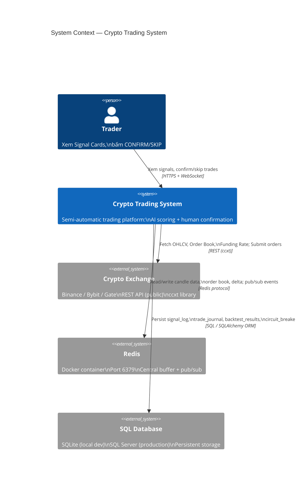
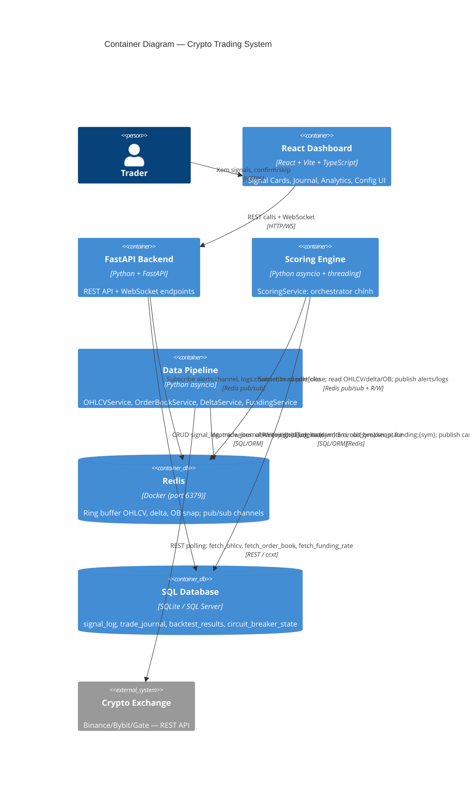

# Phần 1: System Overview Document — Crypto Trading System

## 1.1 Executive Summary

### Mục đích hệ thống

Crypto Trading System là một **Semi-Automatic Crypto Futures Trading Platform** được xây dựng để hỗ trợ trader ra quyết định giao dịch dựa trên tín hiệu từ AI Engine. Hệ thống **không tự động thực thi lệnh** mà yêu cầu xác nhận từ người dùng trước mỗi giao dịch — đây là điểm khác biệt cốt lõi so với fully-automated trading bots.

### Vấn đề giải quyết

| Vấn đề | Giải pháp |
|--------|-----------|
| Trader bỏ lỡ tín hiệu do không theo dõi liên tục | AI Engine tự động scan mọi candle close, push alert real-time |
| Quyết định cảm tính khi thị trường biến động | Scoring system định lượng 5 module độc lập (0–100 pts) |
| Không kiểm soát được rủi ro tổng thể | Portfolio Heat + Circuit Breaker + Correlation Manager |
| Không biết strategy nào hoạt động tốt | Backtest Engine với walk-forward analysis + benchmark table |
| Thua nhiều lần liên tiếp mà vẫn tiếp tục giao dịch | Circuit Breaker tự động khóa khi vượt ngưỡng thua lỗ |

### Các tính năng cốt lõi

1. **Real-time Signal Scoring** — Phân tích mỗi candle close trên 5 module (Order Flow, SMC, VSA, Context, Confluence), cho ra điểm 0–100
2. **Human Confirm Dashboard** — React UI hiển thị Signal Cards với countdown timer, trader CONFIRM hoặc SKIP
3. **Phase 9 Filters** — MTF Bias (4H + Daily), BTC Spike Guard, Circuit Breaker chạy trước khi scoring
4. **Risk Management** — Portfolio Heat limit (6%), Correlation Manager (Pearson 24h), Position Sizing (3 modes)
5. **Backtest Engine** — Walk-forward analysis, anti-overfitting metrics, AI feedback
6. **Config Hot-Reload** — Thay đổi tham số không cần restart process

### Giới hạn và phạm vi

| Giới hạn | Mô tả |
|----------|-------|
| **Order Book** | Chưa start — Order Flow score luôn = 0/35, score bị cap tại 60 |
| **Trade Tape** | Chưa start — Cumulative delta luôn = 0 |
| **WebSocket ingestion** | Chưa implement — dùng REST polling (OHLCVService) |
| **Testnet mode** | Mặc định — cần đặt `testnet: false` tường minh để live trading |
| **Exchanges** | Hỗ trợ qua ccxt (Binance, Bybit, Gate...), chưa test tất cả |
| **Timeframes** | Trigger: 15m; Context: 1H, 4H, Daily |
| **Asset types** | Crypto Futures/Perpetual (USD-margined) |

---

## 1.2 System Context Diagram (C4 Level 1)



**Mô tả mối quan hệ:**

| Mối quan hệ | Giao thức | Hướng | Mô tả |
|-------------|-----------|-------|-------|
| Trader → System | HTTPS (REST) | Hai chiều | Trader gửi CONFIRM/SKIP; nhận Signal Cards qua WebSocket |
| System → Exchange | REST / ccxt | Outbound | Lấy OHLCV 15m/1H/4H/Daily, Order Book (khi chạy), đặt lệnh |
| System ↔ Redis | Redis protocol | Hai chiều | Buffer candle data, pub/sub trigger scoring, pub/sub push alerts |
| System → Database | SQL / ORM | Outbound | Ghi persistent records; đọc lịch sử để analytics |

---

## 1.3 High-Level Architecture Diagram (C4 Level 2)



**Data Flow (mũi tên theo thứ tự):**

```
Exchange ──REST──► Data Pipeline ──atomic write──► Redis
                                                      │
                                              candle_close pub/sub
                                                      │
                                                      ▼
                                            Scoring Engine
                                      (Regime → MTF → BTC Guard → CB → Score → Risk)
                                                      │
                                       ┌──────────────┼──────────────┐
                                       ▼              ▼              ▼
                                  Redis publish    SQL write     Redis CB state
                               (alerts:channel)  (signal_log)
                                       │
                                  FastAPI WS
                                       │
                                  React Dashboard
                                       │
                                  Trader CONFIRM
                                       │
                                  Trade Executor ──ccxt──► Exchange
```

---

## 1.4 Component Inventory Table

| Component | Module/File | Responsibility | Input | Output | Dependencies |
|-----------|-------------|----------------|-------|--------|--------------|
| **OHLCVService** | `data/ohlcv_service.py` | Poll OHLCV từ exchange, ghi Redis ring buffer, publish candle_close | Exchange REST API (ccxt) | Redis `ohlcv:{sym}:{tf}`, pub `candle_close` | ccxt, Redis, config.yaml |
| **OrderBookService** | `data/orderbook_service.py` | Poll Order Book snapshot mỗi 5s | Exchange REST API | Redis `ob:{sym}:snap` | ccxt, Redis |
| **DeltaService** | `data/delta_service.py` | Tính cumulative delta từ trade tape | Exchange REST API (trades) | Redis `delta:{sym}:5m`, `delta_history:{sym}` | ccxt, Redis |
| **FundingService** | `data/funding.py` | Poll funding rate mỗi 8h | Exchange REST API | Redis `funding:{sym}` | ccxt, Redis |
| **ScoringService** | `engine/scoring_service.py` | Orchestrator: nhận candle_close, điều phối pipeline scoring | Redis `candle_close` pub/sub | alerts, logs, signal_log | Redis, SQL, tất cả engine modules |
| **RegimeDetector** | `engine/regime_detector.py` | Phân loại market regime (ADX + ATR) | OHLCV 1H + 15M | RegimeState (TRENDING/RANGING/PARABOLIC/CHOPPY + multiplier) | indicators/adx.py, indicators/atr.py |
| **MTFBiasDetector** | `engine/mtf_bias.py` | Logic phát hiện bias 4H + Daily, quyết định Scenario A/B/C | OHLCV 4H, OHLCV Daily | MTFAlignment (scenario, size_mult, score_adj) | indicators/ema.py, adx.py |
| **BTCVolatilityGuard** | `engine/btc_guard.py` | Logic phát hiện BTC spike, cancel Alt alerts | OHLCV BTC 15M | BTCSpikeState, size_multiplier | Redis `btc_guard:spike`, `cancel_all_alerts` |
| **CircuitBreaker** | `risk/circuit_breaker.py` | 4 triggers tự động khóa trading, smart unlock | Trade results, equity | LockInfo, is_locked() | SQL `circuit_breaker_state`, Redis `circuit_breaker:locked` |
| **FilterRegistry** | `engine/filters/registry.py` | Plugin registry cho signal filters — decorator pattern | config `filters.active` list | List[BaseSignalFilter] instances | engine/filters/ modules |
| **MTFBiasFilter** | `engine/filters/mtf_bias_filter.py` | Wrap MTFBiasDetector vào filter pipeline | filter context dict | FilterResult (scenario A/B/C) | engine/mtf_bias.py |
| **BTCGuardFilter** | `engine/filters/btc_guard_filter.py` | Wrap BTCVolatilityGuard vào filter pipeline | filter context dict | FilterResult (block/pass/reduce) | engine/btc_guard.py |
| **CircuitBreakerFilter** | `engine/filters/circuit_breaker_filter.py` | Wrap CircuitBreaker vào filter pipeline | filter context dict | FilterResult (block nếu locked) | risk/circuit_breaker.py |
| **DailyBiasFilter** | `engine/filters/daily_bias_filter.py` | Reduce size khi Daily BEAR + long signal | filter context dict | FilterResult (size × 0.75, no block) | engine/mtf_bias.detect_daily_bias |
| **AuditClient** | `audit/client.py` | Fire-and-forget audit events đến mock-exchange-workspace | event_type, payload dict | — (RPUSH `audit:pending_snapshots`) | Redis |
| **SignalScorer** | `engine/scorer.py` | Tổng hợp 5 module scores, áp regime multiplier, normalize, cap OB | ScoreInput dataclass | ScoreOutput (final_score, classification, data_quality) | Tất cả sub-modules |
| **OrderFlowAnalysis** | `engine/order_flow.py` | Tính Order Flow score từ delta + bid/ask + absorption | delta, bid_stack, ask_stack, delta_threshold | OrderFlowResult (score 0–35) | Redis `delta:{sym}`, `delta_history:{sym}`, `ob:{sym}:snap` |
| **SMCAnalysis** | `engine/smc.py` | 2-pass: Pass 1 detect direction từ CHoCH, Pass 2 direction-aware OB filter | OHLCV 15M + 1H, signal_direction | SMCResult (score 0–30, order_blocks, htf_bias) | OHLCV data |
| **VSAModule** | `engine/vsa.py` + `engine/volume_profile.py` | VSA (No Supply, EvR, POC check) — takes delta as extra param | OHLCV, POC/VAH/VAL, atr, delta | VSA score (0–30), absorption flag | Redis `poc:{sym}` |
| **ContextFilter** | `engine/context.py` | Kiểm tra 1H bias alignment, funding rate, nearest S/R distance | OHLCV 1H, signal_direction, funding, htf_bias | ContextResult (score 0–15) | Redis `funding:{sym}` |
| **ConfluenceBonus** | `engine/confluence.py` | Bonus OB + Fib + FVG; POC param ignored (Phase 9 fix) | OrderBlock list/single, FVG, ohlcv | bonus float (0–15) | SMCAnalysis output |
| **LogPublisher** | `engine/log_publisher.py` | Build và publish log entry cho mọi candle scoring | scoring module outputs | Redis PUBLISH `logs:channel` | Redis |
| **CorrelationManager** | `engine/correlation_manager.py` | Pearson correlation 24h, Portfolio Heat | OHLCV 1H tất cả assets | correlation_matrix, portfolio_heat | pandas, OHLCV data |
| **RiskManager** | `risk/manager.py` | Position sizing (3 modes), Portfolio Heat + Correlated Risk check | Signal, equity, open positions | position_size_usd, rejection_reason | CorrelationManager, config.yaml |
| **AlertBuilder** | `alert/builder.py` | Build Signal Card payload từ scoring outputs | Signal + score results | SignalCard JSON | strategies/signal.py Signal |
| **SignalLogWriter** | `api/signal_log_writer.py` | Ghi Signal object vào SQL signal_log table | Signal object, DB session | log_id (UUID str) | db/models.py, db/connection.py |
| **ConfigService** | `config/config_service.py` | Quản lý Group A (TradingParams) và Group B (ExchangeSettings) trong SQL; AES-256 encrypt API keys | DB session | TradingParams dict, ExchangeSettings | db, cryptography lib |
| **ConfigResolver** | `config/config_resolver.py` | Merge DB config + config.yaml thành unified config | ConfigSystem + DB | unified config dict | config_system.py, config_service.py |
| **FastAPI Backend** | `api/main.py` | REST + WebSocket endpoints; API key auth (`require_api_key`) | HTTP/WS requests, Redis pub/sub | JSON responses, WS messages | Redis, SQL, AuditClient |
| **React Frontend** | `workspace/frontend-workspace/` | Signal Cards UI, Journal, Analytics, Config | WebSocket messages, REST | User actions (CONFIRM/SKIP) | FastAPI Backend |
