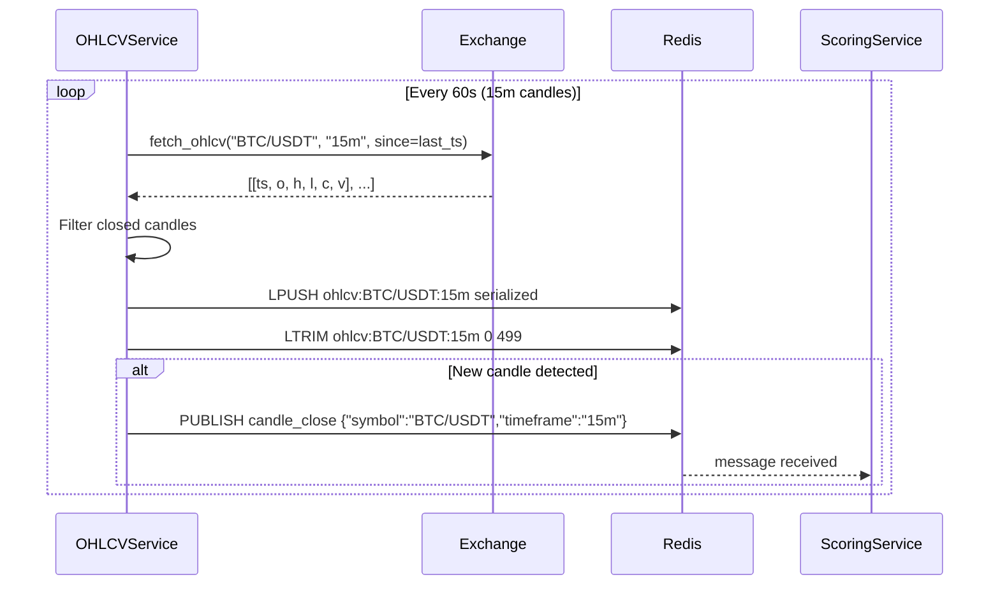
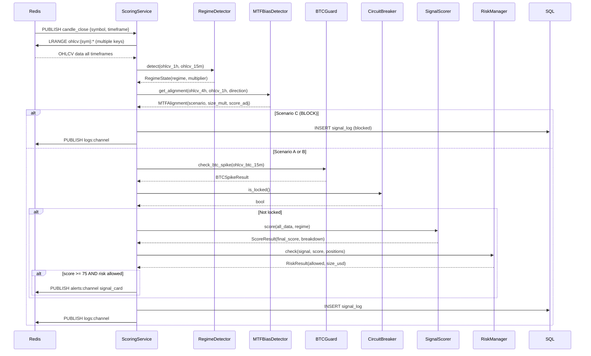

# Phần 2: Detailed Service Documentation — Crypto Trading System

> **Cập nhật sau code review:** Tài liệu này đã được cập nhật để phản ánh kiến trúc thực tế của codebase, bao gồm Filter Registry Pattern, AuditClient, ATR-based SL/TP, và 2-pass SMC scoring.

---

## Filter Registry Architecture (engine/filters/)

> **GAP đã sửa:** Đây là kiến trúc quan trọng KHÔNG có trong tài liệu ban đầu. Toàn bộ pipeline filter (MTF, BTC Guard, Circuit Breaker, Daily Bias) được quản lý qua một plugin registry — không phải gọi trực tiếp.

### Mục đích
Plugin-based filter pipeline cho signal scoring. Mỗi filter là một `BaseSignalFilter` subclass, được register qua `@FilterRegistry.register("name")` decorator. ScoringService load active filters từ config và chạy tuần tự — nếu bất kỳ filter nào trả về `passed=False`, signal bị block ngay lập tức.

### Cấu trúc

```
engine/filters/
├── base.py              # BaseSignalFilter (ABC) + FilterResult dataclass
├── registry.py          # FilterRegistry: @register decorator, load_active(), auto_discover()
├── mtf_bias_filter.py   # @FilterRegistry.register("mtf_bias")
├── btc_guard_filter.py  # @FilterRegistry.register("btc_guard")
├── circuit_breaker_filter.py  # @FilterRegistry.register("circuit_breaker")
└── daily_bias_filter.py       # @FilterRegistry.register("daily_bias")
```

### BaseSignalFilter Interface

```python
class BaseSignalFilter(ABC):
    name: str = ""  # Registry key — override in subclass

    @abstractmethod
    def apply(self, context: dict) -> FilterResult:
        """
        context dict keys:
            symbol, timeframe, signal_direction
            ohlcv, ohlcv_1h, ohlcv_4h, ohlcv_daily, ohlcv_btc
            regime_state, htf_bias_1h
            delta, bid_stack, ask_stack, funding_rate
            r (Redis client)
        """
        ...
```

### FilterResult Dataclass

```python
@dataclass
class FilterResult:
    passed: bool = True
    block_reason: Optional[str] = None
    score_adjustment: float = 0.0   # +10 (A), -10 (B), -999 (C/block)
    size_multiplier: float = 1.0    # 1.0 (A), 0.5 (B), 0.0 (C)
    warning: Optional[str] = None   # Shown on Signal Card
    filter_name: str = ""
    metadata: dict = field(default_factory=dict)

    @classmethod
    def block(cls, reason, filter_name=""): ...         # passed=False, size=0.0
    @classmethod
    def pass_with_warning(cls, score_adjustment, size_multiplier, warning, ...): ... # Scenario B
    @classmethod
    def pass_clean(cls, score_adjustment=0.0, ...): ... # Scenario A
```

### FilterRegistry

```python
class FilterRegistry:
    _registry: Dict[str, Type[BaseSignalFilter]] = {}

    @classmethod
    def register(cls, name: str): ...        # @decorator để register filter class
    @classmethod
    def load_active(cls, enabled: List[str]) -> List[BaseSignalFilter]: ...
    @classmethod
    def auto_discover(cls, package="engine.filters") -> None: ...  # Auto-import tất cả filter modules
```

**Auto-discovery:** `load_active()` tự động gọi `auto_discover()` trước khi instantiate — không cần import thủ công từng filter.

### 4 Registered Filters

| Filter name | Class | Block? | score_adj | size_mult | Condition |
|-------------|-------|--------|-----------|-----------|-----------|
| `mtf_bias` | MTFBiasFilter | Scenario C | +10 (A) / -10 (B) | 1.0 / 0.5 / 0.0 | 4H bias vs signal direction |
| `btc_guard` | BTCGuardFilter | BTC dump | 0 | 0.0 (dump) / 0.5 (pump) | BTC spike >2% in 15m |
| `circuit_breaker` | CircuitBreakerFilter | Luôn block nếu locked | 0 | 0.0 | is_locked() == True |
| `daily_bias` | DailyBiasFilter | Không bao giờ | 0 | 0.75 (BEAR+long) / 1.0 | Daily BEAR + long signal |

### Pipeline Execution trong ScoringService

```python
active_filter_names = config.get("filters.active", ["mtf_bias", "btc_guard", "circuit_breaker", "daily_bias"])
active_filters = FilterRegistry.load_active(active_filter_names)

combined_size_mult = 1.0
filter_warnings = []

for f in active_filters:
    result = f.apply(filter_context)
    if not result.passed:
        publish_log(blocked)
        emit_audit(blocked)
        return  # Stop pipeline immediately

    combined_size_mult *= result.size_multiplier
    if result.warning:
        filter_warnings.append(result.warning)

# After all filters pass:
# Apply score adjustments from filter results
total_score_adj = sum(r["score_adjustment"] for r in filter_extras.values() if r.get("score_adjustment", 0) != 0)
if total_score_adj != 0:
    final = max(0, min(100, score.final_score + int(total_score_adj)))
```

**Quan trọng:** `daily_bias` là filter **thứ 4 riêng biệt**, không phải một phần của `mtf_bias` filter. Daily bias chỉ giảm size, không block.

---

## AuditClient

> **GAP đã sửa:** Module này hoàn toàn không có trong tài liệu ban đầu.

### Mục đích
Fire-and-forget audit event publisher. Gửi signal snapshots và trade events đến `mock-exchange-workspace` qua Redis list `audit:pending_snapshots`. Không bao giờ throw exception — tất cả lỗi được log và swallow.

### Vị trí trong hệ thống
- **File:** `workspace/backend-workspace/audit/client.py`
- **Injected vào:** ScoringService constructor (`audit_client=AuditClient(redis)`)
- **Consumer:** mock-exchange-workspace (BLPOP từ `audit:pending_snapshots`)

### Đối tượng/Class chính

```python
class AuditClient:
    def __init__(self, redis_client, enabled: bool = True): ...

    def emit(self, event_type: str, payload: dict) -> None:
        # RPUSH "audit:pending_snapshots" json.dumps({"type": event_type, **payload})

    def emit_trade_opened(self, signal_id, order_id, symbol, direction,
                           entry_price, amount, leverage, sl, tp1, tp2=None): ...

    def emit_trade_closed(self, order_id, exit_price, exit_reason): ...
```

### Event Types

| Event | Trigger | Key Fields |
|-------|---------|------------|
| `signal_snapshot` | Mỗi candle scoring cycle | symbol, timeframe, final_score, signal_result, regime, blocking_reason, entry/sl/tp1/tp2, atr, adx, delta, funding_rate |
| `trade_opened` | Sau khi CONFIRM + fill | signal_id, order_id, symbol, direction, entry_price, amount, leverage, sl, tp1, tp2 |
| `trade_closed` | SL/TP hit | order_id, exit_price, exit_reason |

### Redis Key

| Key | Type | Writer | Consumer |
|-----|------|--------|---------|
| `audit:pending_snapshots` | List (queue) | AuditClient (RPUSH) | mock-exchange-workspace (BLPOP) |

---

## OHLCVService

### Mục đích
Thu thập dữ liệu nến (OHLCV) từ exchange qua REST polling, lưu vào Redis ring buffer, và publish event `candle_close` khi phát hiện nến mới đóng.

### Vị trí trong hệ thống
- **File:** `workspace/backend-workspace/data/ohlcv_service.py`
- **Layer:** Data Layer (Layer 1)
- **Dependencies:** ccxt, Redis, config.yaml (`assets`, `exchange`)

### Đối tượng/Class chính

```python
class OHLCVService:
    def __init__(self, redis_client, exchange_id, symbols, timeframes, config):
        self.redis = redis_client
        self.exchange = ccxt_exchange_instance
        self.symbols = symbols          # ["BTC/USDT", "ETH/USDT", ...]
        self.timeframes = timeframes    # ["15m", "1h", "4h", "1d"]
        self.last_candle_ts = {}        # {sym:{tf}: last_known_timestamp}
```

### Phương thức công khai

| Method | Input | Output | Side Effects | Description |
|--------|-------|--------|--------------|-------------|
| `start()` | — | — | Khởi chạy asyncio loop | Entry point: seed + polling loop |
| `seed_historical(symbol, tf, limit)` | symbol, tf, limit=200 | — | Ghi Redis ring buffer | Fetch lịch sử ban đầu khi startup |
| `poll_ohlcv(symbol, tf)` | symbol, timeframe | `List[Candle]` | Ghi Redis, publish candle_close | Fetch candles mới, detect close |
| `_write_candle(symbol, tf, candle)` | symbol, tf, OHLCV dict | — | LPUSH + LTRIM Redis | Atomic write vào ring buffer |
| `_detect_candle_close(symbol, tf, candles)` | symbol, tf, candle list | `bool` | Publish `candle_close` | So sánh timestamp với last known |

### Data Flow

```
Input:  ccxt.fetch_ohlcv(symbol, tf, since=last_ts)
        → List[OHLCV tuple] = [[timestamp, open, high, low, close, volume], ...]

Processing:
        → Lọc nến đã đóng (timestamp < current_time - tf_seconds)
        → Serialize: json.dumps({"ts": ..., "o": ..., "h": ..., "l": ..., "c": ..., "v": ...})
        → LPUSH ohlcv:{symbol}:{tf} serialized_candle
        → LTRIM ohlcv:{symbol}:{tf} 0 499  (giữ 500 nến gần nhất)

Candle Close Detection:
        → Nếu candle[-1].timestamp > last_known_timestamp[sym][tf]:
              PUBLISH candle_close json.dumps({"symbol": sym, "timeframe": tf, "timestamp": ts})

Output: Redis key ohlcv:{symbol}:{tf} (ring buffer, list, 500 items)
        Redis pub/sub candle_close
```

### Error Handling

| Lỗi | Handling |
|-----|----------|
| ccxt NetworkError | Retry 3× với exponential backoff (1s, 2s, 4s) |
| ccxt ExchangeError | Log warning, bỏ qua cycle hiện tại, retry ở cycle sau |
| Missing candles (gap) | Linear interpolation OHLCV fields; log gap |
| Redis connection error | Raise exception, service tự restart |

### Configuration

| Parameter | config.yaml path | Default | Mô tả |
|-----------|-----------------|---------|-------|
| Exchange ID | `exchange.name` | `"binance"` | ccxt exchange identifier |
| Symbols | `assets[].symbol` | `["BTC/USDT"]` | Danh sách symbols cần monitor |
| Poll interval 15m | hardcoded | 60s | Polling interval cho 15m candles |
| Poll interval 4H | hardcoded | 300s | Polling interval cho 4H candles |
| BTC always monitored | hardcoded | — | BTC/USDT luôn được thêm vào |

### Redis Keys

| Key | Operation | Format | Description |
|-----|-----------|--------|-------------|
| `ohlcv:{sym}:{tf}` | LPUSH + LTRIM (write), LRANGE (read) | JSON list | Ring buffer 500 nến |
| `candle_close` | PUBLISH (write) | `{"symbol": str, "timeframe": str, "timestamp": int}` | Event trigger cho ScoringService |

### Sequence Diagram



---

## OrderBookService

### Mục đích
Poll Order Book snapshot từ exchange mỗi 5 giây, tính Bid Stack và Ask Stack tại vùng S/R, lưu vào Redis.

### Vị trí trong hệ thống
- **File:** `workspace/backend-workspace/data/orderbook_service.py`
- **Layer:** Data Layer (Layer 1)
- **Status:** ⚠️ Chưa start — score Order Flow = 0/35

### Đối tượng/Class chính

```python
class OrderBookService:
    def __init__(self, redis_client, exchange, symbols, depth=20):
        self.redis = redis_client
        self.exchange = exchange
        self.symbols = symbols
        self.depth = depth              # Số levels bid/ask cần fetch
```

### Phương thức công khai

| Method | Input | Output | Side Effects | Description |
|--------|-------|--------|--------------|-------------|
| `start()` | — | — | Asyncio polling loop | Entry point |
| `poll_orderbook(symbol)` | symbol | OBSnapshot | Ghi Redis `ob:{sym}:snap` | Fetch + compute bid/ask stack |
| `compute_bid_ask_stack(orderbook, price_range_pct)` | ccxt OB dict, pct | `(bid_stack, ask_stack)` | — | Tổng volume trong ±price_range_pct% từ mid |
| `detect_absorption(orderbook, ohlcv)` | OB dict, OHLCV | `bool` | — | Volume lớn nhưng giá không di chuyển |

### Redis Keys

| Key | Operation | Format | Description |
|-----|-----------|--------|-------------|
| `ob:{sym}:snap` | SET (write), GET (read) | JSON `{"bid_stack": float, "ask_stack": float, "mid": float, "absorption": bool, "ts": int}` | Order Book snapshot |

---

## DeltaService

### Mục đích
Poll trade tape từ exchange để tính Cumulative Delta (buy_volume - sell_volume), lưu vào Redis. Cập nhật lịch sử 24h delta cho Dynamic Threshold.

### Vị trí trong hệ thống
- **File:** `workspace/backend-workspace/data/delta_service.py`
- **Layer:** Data Layer (Layer 1)
- **Status:** ⚠️ Chưa start — delta luôn = 0

### Đối tượng/Class chính

```python
class DeltaService:
    def __init__(self, redis_client, exchange, symbols):
        self.redis = redis_client
        self.exchange = exchange
        self.symbols = symbols
        self.current_candle_start = {}  # {symbol: candle_open_timestamp}
```

### Redis Keys

| Key | Operation | Format | Description |
|-----|-----------|--------|-------------|
| `delta:{sym}:5m` | SET (write), GET (read) | float (string) | Cumulative delta nến hiện tại (reset mỗi nến) |
| `delta_history:{sym}` | RPUSH + LTRIM (write), LRANGE (read) | JSON list floats | 96 giá trị delta 24h (TTL 25h) — dùng cho Dynamic Threshold |

---

## FundingService

### Mục đích
Poll funding rate từ exchange mỗi 8 giờ, lưu vào Redis. Funding rate dùng trong Context Filter (+4 pts nếu neutral).

### Vị trí trong hệ thống
- **File:** `workspace/backend-workspace/data/funding.py`
- **Layer:** Data Layer (Layer 1)

### Đối tượng/Class chính

```python
class FundingService:
    def __init__(self, redis_client, exchange, symbols):
        self.redis = redis_client
        self.exchange = exchange
        self.symbols = symbols
        self.poll_interval = 8 * 3600  # 8 giờ
```

### Phương thức công khai

| Method | Input | Output | Side Effects | Description |
|--------|-------|--------|--------------|-------------|
| `start()` | — | — | Asyncio loop | Entry point |
| `fetch_funding_rate(symbol)` | symbol | `float` | Ghi Redis | Gọi ccxt fetch_funding_rate |

### Redis Keys

| Key | Operation | Format | Description |
|-----|-----------|--------|-------------|
| `funding:{sym}` | SET (write), GET (read) | JSON `{"rate": float, "next_ts": int, "ts": int}` | Funding rate hiện tại |

---

## ScoringService

### Mục đích
Orchestrator chính của AI Engine. Nhận `candle_close` event từ Redis pub/sub, điều phối toàn bộ pipeline scoring, publish kết quả.

### Vị trí trong hệ thống
- **File:** `workspace/backend-workspace/engine/scoring_service.py`
- **Layer:** AI Engine (Layer 2)
- **Pattern:** asyncio event loop + threading.Thread cho pub/sub subscription

### Đối tượng/Class chính

```python
class ScoringService:
    def __init__(self, redis_client, db_session, config):
        self.redis = redis_client
        self.db = db_session
        self.config = config
        self.regime_detector = RegimeDetector(config)
        self.mtf_detector = MTFBiasDetector(redis_client)
        self.btc_guard = BTCVolatilityGuard(redis_client)
        self.circuit_breaker = CircuitBreaker(redis_client, db_session)
        self.risk_manager = RiskManager(config)
        self.scorer = SignalScorer(config)
```

### Phương thức công khai (Thực tế)

| Method | Input | Output | Side Effects | Description |
|--------|-------|--------|--------------|-------------|
| `start()` | — | — | Subscribe candle_close, start background thread | Entry point |
| `_run_cycle(symbol, timeframe)` | sym, tf | — | Toàn bộ pipeline | Main coroutine được dispatch qua run_coroutine_threadsafe |
| `_get_sl_tp_params()` | — | tuple (sl_mult, tp1_rr, tp2_rr, min_net_rr, fee_rate) | Read DB/config | Priority: DB > config.yaml > module constants |
| `_compute_sl_tp(entry, atr, direction, ...)` | floats | (sl, tp1, tp2, gross_rr, net_rr) | — | ATR-based SL/TP với net R:R tính sau phí |
| `_persist_signal(...)` | all scoring outputs | log_id (UUID str) | SQL INSERT signal_log | Calls api/signal_log_writer.write_signal_log |
| `_publish_alert(...)` | all scoring outputs | — | PUBLISH alerts:channel | Signal Card JSON |
| `_get_active_filters()` | — | list[str] | Read config | DB > config.yaml > default ["mtf_bias","btc_guard","circuit_breaker","daily_bias"] |
| `_emit_audit(audit_data)` | dict | — | RPUSH audit:pending_snapshots | Fire-and-forget via AuditClient |

### Data Flow (Thực tế — v2.0 sau code review)

```
[1] Subscribe candle_close → receive {"symbol": "BTC/USDT", "timeframe": "15m", "close": 45230.5}

[2] Read market data từ Redis:
    - ohlcv:{sym}:{15m, 1h, 4h, 1d}
    - ob:{sym}:snap → tính ob_age = now - updated_at
      OB stale nếu: ob_age > 60s OR bid_stack == ask_stack == 0
    - delta:{sym}:5m (đọc, snapshot vào delta_history, rồi RESET về "0")
    - delta_history:{sym} (RPUSH delta, LTRIM 96, TTL 25h)
    - funding:{sym}
    - ohlcv:BTC/USDT:15m (10 nến cho BTC spike check)

[3] Compute indicators:
    ATR(14) từ ohlcv_15m
    ADX(14) từ ohlcv_1h (fallback ohlcv nếu 1H empty)
    regime = RegimeDetector.classify(ohlcv_1h, ohlcv_15m)

[4] Pre-filter computations:
    vp = compute_volume_profile(ohlcv.iloc[-96:])
    htf_bias = detect_htf_bias(ohlcv_1h)
    
    # 2-Pass SMC
    _smc_raw = compute_smc_score(ohlcv, ohlcv_1h, htf_bias=htf_bias)  # Pass 1: detect direction
    signal_direction = "short" if (_smc_raw.choch.direction=="bearish" AND _smc_raw.htf_bias=="bearish") else "long"
    smc = compute_smc_score(ohlcv, ohlcv_1h, signal_direction=signal_direction, htf_bias=htf_bias)  # Pass 2
    
    vsa = compute_vsa_score(ohlcv, vp, atr_val, delta)  # delta là tham số
    nearest_sr_distance_pct = min S/R distance từ OB + FVG boundaries
    
    correlation_manager.update(symbol, ohlcv_1h)  # Update correlation matrix

[5] Filter Pipeline (FilterRegistry):
    active_filters = FilterRegistry.load_active(["mtf_bias", "btc_guard", "circuit_breaker", "daily_bias"])
    combined_size_mult = 1.0
    for f in active_filters:
        result = f.apply(filter_context)
        if not result.passed:
            publish_log(blocked); emit_audit(blocked); return  # STOP
        combined_size_mult *= result.size_multiplier
    
    daily_bias = detect_daily_bias(ohlcv_daily)
    r.set(daily_bias:{sym}, daily_bias, ex=14400)  # TTL 4h

[6] Scoring modules:
    of = compute_order_flow_score(delta, bid_stack, ask_stack,
                                   absorption=vsa.absorption OR ob_data["bid_dominant"],
                                   delta_threshold=dynamic_threshold)
    ctx = compute_context_score(ohlcv_1h, signal_direction, funding_rate, nearest_sr_distance_pct, htf_bias)
    bonus = compute_confluence_bonus(ohlcv, smc.order_blocks, smc.fvg, vp.poc)
    
    score = SignalScorer().score(ScoreInput(
        order_flow=of.score, smc=smc.score, vsa=vsa.score, context=ctx.score,
        bonus=bonus, regime_multiplier=regime.score_multiplier,
        direction=signal_direction, regime=regime.regime,
        order_book_available=order_book_available  # OB cap applied INSIDE scorer
    ))
    
    # Apply sum of all filter score adjustments
    total_adj = sum(r["score_adjustment"] for r in filter_extras.values())
    if total_adj != 0:
        score = ScoreOutput(max(0, min(100, score.final_score + total_adj)), ...)

[7] ATR-based SL/TP:
    sl_atr_mult=1.5, tp1_rr=2.0, tp2_rr=3.0, min_net_rr=1.5, fee_rate=0.001
    (params từ DB TradingParams > config.yaml > module constants)
    sl_dist = atr_val × sl_atr_mult
    net_rr = (tp1_pct - fee_total) / (sl_pct + fee_total)

[8] Persist signal_log:
    signal_id = write_signal_log(Signal(...), db)

[9] Emit audit snapshot:
    audit_client.emit("signal_snapshot", {final_score, signal_result, regime, blocking_reason, ...})

[10] Publish ALERT (nếu ĐỦ điều kiện):
    score.classification == "ALERT"
    AND atr_val > 0       (có SL/TP hợp lệ)
    AND net_rr >= 1.5     (đủ R:R sau phí)
    → PUBLISH alerts:channel

[11] Luôn luôn:
    PUBLISH logs:channel (full debug log)
```

### Sequence Diagram



---

## RegimeDetector

### Mục đích
Phân loại market regime dựa trên ADX (sức mạnh xu hướng) và ATR (biến động), trả về regime state và score multiplier.

### Vị trí trong hệ thống
- **File:** `workspace/backend-workspace/engine/regime_detector.py`
- **Layer:** AI Engine (Layer 2) — chạy đầu tiên trong pipeline

### Phương thức công khai

| Method | Input | Output | Side Effects | Description |
|--------|-------|--------|--------------|-------------|
| `detect(ohlcv_1h, ohlcv_15m)` | DataFrame 1H, DataFrame 15M | RegimeState | Ghi Redis `regime:{sym}` | Main detection logic |

### Scoring Rules

```
Priority 1: PARABOLIC
    Condition: ATR_15m[-1] > 3.0 × rolling_mean(ATR_15m[-20:])
    Multiplier: 0.6
    Side effect: suppress_short = True

Priority 2: TRENDING
    Condition: ADX_1h[-1] > 25
    Multiplier: 1.0

Priority 3: CHOPPY
    Condition: ADX_1h[-1] < 20
    Multiplier: 0.85

Default: RANGING
    Condition: 20 ≤ ADX_1h[-1] ≤ 25
    Multiplier: 0.85
```

### Redis Keys

| Key | Operation | Format |
|-----|-----------|--------|
| `regime:{sym}` | SET (write) | JSON `{"regime": str, "multiplier": float, "adx": float, "atr": float, "ts": int}` |

---

## MTFBiasDetector

### Mục đích
Phát hiện bias market ở khung 4H và Daily để lọc tín hiệu theo xu hướng lớn. Áp dụng 3 scenarios với size multiplier và score adjustment khác nhau.

### Vị trí trong hệ thống
- **File:** `workspace/backend-workspace/engine/mtf_bias.py`
- **Layer:** AI Engine (Layer 2) — Phase 9, chạy sau RegimeDetector

### Phương thức công khai

| Method | Input | Output | Side Effects | Description |
|--------|-------|--------|--------------|-------------|
| `detect_4h_bias(ohlcv_4h)` | DataFrame 4H | `str` (BULLISH/BEARISH/RANGING) | — | EMA200 + higher lows/lower highs + ADX |
| `detect_daily_bias(ohlcv_daily)` | DataFrame Daily | `str` (BULL/BEAR/NEUTRAL) | Ghi Redis `daily_bias:{sym}` (TTL 4h) | EMA200 + EMA50 + swing structure |
| `get_mtf_alignment(bias_4h, bias_1h, signal_dir)` | 3 strings | MTFAlignment | — | Quyết định Scenario A/B/C |
| `get_daily_size_multiplier(daily_bias, signal_dir)` | 2 strings | float | — | BEAR daily + long → 0.75 |

### MTF Alignment Matrix

| 4H Bias | 1H Bias | Signal | Scenario | Size Mult | Score Adj |
|---------|---------|--------|----------|-----------|-----------|
| BULLISH | BULLISH | Long | A | 1.0 | +10 |
| BEARISH | BEARISH | Short | A | 1.0 | +10 |
| BULLISH | BEARISH | Short | A | 1.0 | +10 |
| RANGING | BULLISH | Long | B | 0.5 | -10 |
| RANGING | BEARISH | Short | B | 0.5 | -10 |
| BEARISH (ADX>25) | Bullish | Long | C | 0.0 | BLOCK |
| BULLISH (ADX>25) | Bearish | Short | C | 0.0 | BLOCK |

### detect_4h_bias Logic

```python
# bullish: price > EMA200 AND higher lows (last 3 swings) AND ADX > 20
# bearish: price < EMA200 AND lower highs (last 3 swings) AND ADX > 20
# ranging: ADX < 20 OR price oscillating around EMA200
```

### detect_daily_bias Logic

```python
# BULL:    close > EMA200 AND close > EMA50 AND >= 3 higher lows in last 10 days
# BEAR:    close < EMA200 AND close < EMA50 AND >= 3 lower highs in last 10 days
# NEUTRAL: otherwise
```

### Redis Keys

| Key | Operation | Format | TTL |
|-----|-----------|--------|-----|
| `daily_bias:{sym}` | SET (write), GET (read) | JSON `{"bias": str, "ts": int}` | 4h |

---

## BTCVolatilityGuard

### Mục đích
Bảo vệ Alt positions khi BTC có biến động đột ngột (spike). Khi BTC dump → cancel tất cả Alt alerts. Khi BTC pump → giảm size 50%.

### Vị trí trong hệ thống
- **File:** `workspace/backend-workspace/engine/btc_guard.py`
- **Layer:** AI Engine (Layer 2) — Phase 9, chỉ áp dụng cho non-BTC symbols

### Phương thức công khai

| Method | Input | Output | Side Effects | Description |
|--------|-------|--------|--------------|-------------|
| `check_btc_spike(ohlcv_btc_15m)` | DataFrame BTC 15M | BTCSpikeState | Ghi Redis `btc_guard:spike` | Detect spike: \|close-open\|/open > 2% |
| `check_alt_signal(alt_sym, alt_gain_pct, signal_dir)` | 3 params | float (size_mult) | — | Kiểm tra trong cooldown: relative weakness |
| `cancel_all_alt_alerts()` | — | — | PUBLISH `cancel_all_alerts` | BTC dump → hủy tất cả Alt Signal Cards |
| `reset_alt_deltas(symbols)` | list[str] | — | SET `delta:{sym}:5m = 0` | Reset delta cho tất cả Alt |

### Spike Detection Logic

```
Spike Detection:
    spike_pct = abs(close - open) / open
    if spike_pct > 0.02 (2%):
        direction = "dump" if close < open else "pump"
        cooldown_until = now + 30min
        SETEX btc_guard:spike json_data TTL=(30min + 60s)

Action by direction:
    DUMP: cancel_all_alt_alerts() + reset_alt_deltas() → size_mult = 0.0
    PUMP: size_mult = 0.5

Cooldown Check for Alt signal:
    In cooldown + DUMP → block Alt long → size_mult = 0.0
    In cooldown + PUMP + Alt gain < 0.3× BTC gain → block (relative weakness)
    In cooldown + PUMP + Alt gain ≥ 0.3× BTC gain → size_mult = 0.5
    Not in cooldown → size_mult = 1.0
```

### Redis Keys

| Key | Operation | Format | TTL |
|-----|-----------|--------|-----|
| `btc_guard:spike` | SET (write), GET (read) | JSON `{"direction": str, "magnitude": float, "cooldown_until": int}` | cooldown + 60s |
| `cancel_all_alerts` | PUBLISH | `{"reason": "btc_dump", "ts": int}` | — |

---

## CircuitBreaker

### Mục đích
Tự động khóa trading khi vượt ngưỡng thua lỗ. 4 triggers với thời gian lock khác nhau. Smart Unlock kiểm tra regime change trước khi mở lại.

### Vị trí trong hệ thống
- **File:** `workspace/backend-workspace/risk/circuit_breaker.py`
- **Layer:** Risk Layer — Phase 9
- **State:** SQL `circuit_breaker_state` table + Redis `circuit_breaker:locked` (fast-path cache)

### Phương thức công khai

| Method | Input | Output | Side Effects | Description |
|--------|-------|--------|--------------|-------------|
| `is_locked()` | — | `bool` | Read Redis fast-path | Kiểm tra nhanh trước mỗi scoring |
| `check_and_trigger(trade_result, equity, daily_pnl, seven_day_peak)` | 4 params | LockInfo \| None | SQL INSERT, Redis SET, PUBLISH cb:events | Kiểm tra 4 triggers |
| `try_unlock(current_regime)` | RegimeState | `bool` | SQL UPDATE, Redis DEL | Smart unlock sau khi lock hết hạn |
| `manual_unlock(review_note, unlocked_by)` | 2 strings | `bool` | SQL UPDATE, Redis DEL, PUBLISH | Manual unlock (required for Trigger 4) |
| `get_status()` | — | LockInfo \| None | Read SQL + Redis | Trả về trạng thái hiện tại cho API |

### 4 Triggers

| Trigger | Condition | Lock Duration | Requires Review |
|---------|-----------|---------------|-----------------|
| T1: Consecutive Losses | 3 thua liên tiếp trong 24h | 12h | Không |
| T2: Single Loss Magnitude | Một lần thua > 4% equity | 6h | Không |
| T3: Daily Loss Cap | Tổng thua trong ngày > 5% equity | Đến 00:00 UTC | Không |
| T4: Drawdown from Peak | Drawdown > 10% từ đỉnh 7-day | 24h | **Có** (≥ 10 ký tự) |

### Smart Unlock Logic

```
Sau khi lock_at đã qua:
    current_regime = RegimeDetector.detect(current_ohlcv)
    regime_at_trigger = circuit_breaker_state.regime_at_trigger

    if current_regime != regime_at_trigger:
        → Auto unlock (thị trường đã thay đổi)
    else:
        → Extend 6h (regime chưa thay đổi)
        → Notify user qua circuit_breaker:events

    Trigger 4 → luôn cần manual review note (min 10 ký tự)
```

### Redis Keys

| Key | Operation | Format | TTL |
|-----|-----------|--------|-----|
| `circuit_breaker:locked` | SET (write), GET (read), DEL | "1" hoặc "0" | lock_duration + 60s |
| `circuit_breaker:recent_losses` | RPUSH + LRANGE | JSON list trade results | 24h |
| `circuit_breaker:7day_peak` | SET (write), GET (read) | float (equity peak) | 7 days |
| `circuit_breaker:events` | PUBLISH | JSON `{"event": str, "trigger": str, "unlock_at": int}` | — |

---

## SignalScorer

### Mục đích
Tổng hợp điểm từ 5 module (OrderFlow, SMC, VSA, Context, Confluence), áp regime multiplier, normalize về [0–100], áp Phase 9 adjustments.

### Vị trí trong hệ thống
- **File:** `workspace/backend-workspace/engine/scorer.py`
- **Layer:** AI Engine (Layer 2)

### Phương thức công khai

| Method | Input | Output | Side Effects | Description |
|--------|-------|--------|--------------|-------------|
| `score(market_data, regime_state, mtf_alignment)` | MarketData, RegimeState, MTFAlignment | ScoreResult | — | Main scoring method |
| `_compute_all_modules(market_data)` | MarketData | dict scores | — | Gọi 5 sub-modules song song |

### Scoring Formula

```python
raw = order_flow_score + smc_score + vsa_score + context_score + confluence_bonus
final = min(round(raw * regime_multiplier / 125 * 100), 100)

# Phase 9 adjustments (sau normalization):
final += mtf_score_adjustment  # +10 (A), -10 (B), BLOCK (C)
if not order_book_available:
    final = min(final, 60)     # data quality cap

# Classification:
# ≥ 75 → ALERT
# 55–74 → WATCH
# < 55 → IGNORE
```

---

## OrderFlowAnalysis

### Mục đích
Đo lường áp lực mua/bán từ tổ chức dựa trên Cumulative Delta, Bid vs Ask Stack, và Absorption.

### Vị trí trong hệ thống
- **File:** `workspace/backend-workspace/engine/order_flow.py`
- **Layer:** AI Engine (Layer 2)

### Phương thức công khai

| Method | Input | Output | Side Effects | Description |
|--------|-------|--------|--------------|-------------|
| `compute_score(delta, bid_stack, ask_stack, absorption, delta_history)` | 5 params | OrderFlowResult | — | Main scoring |
| `compute_dynamic_threshold(delta_history)` | list[float] | float | — | percentile_75 × 1.5 |

### Scoring Rules

| Condition | Points | Ghi chú |
|-----------|--------|---------|
| delta > dynamic_threshold | +15 | Institutional buying pressure |
| bid_stack > ask_stack × 2.0 | +10 | Bid dominance at key level |
| absorption == True | +10 | Volume absorbed without price decline |
| **Max** | **35** | |

### Dynamic Threshold

```python
def compute_dynamic_threshold(delta_history: list) -> float:
    if len(delta_history) < 10:
        return 1000.0  # fallback
    abs_deltas = [abs(d) for d in delta_history if d != 0]
    if not abs_deltas:
        return 1000.0
    p75 = np.percentile(abs_deltas, 75)
    return max(100.0, min(p75 * 1.5, 50000.0))  # bounds: [100, 50000]
```

---

## SMCAnalysis

### Mục đích
Phát hiện Smart Money footprint: Change of Character (CHoCH), Order Block (OB), Fair Value Gap (FVG).

### Vị trí trong hệ thống
- **File:** `workspace/backend-workspace/engine/smc.py`
- **Layer:** AI Engine (Layer 2)

### Phương thức công khai

| Method | Input | Output | Side Effects | Description |
|--------|-------|--------|--------------|-------------|
| `compute_score(ohlcv_15m, ohlcv_1h)` | 2 DataFrames | SMCResult | — | Main scoring |
| `find_order_block(ohlcv, atr_mult, max_obs)` | DataFrame, float, int | List[OrderBlock] | — | Tìm tối đa 3 OB, Fib-prioritized |
| `find_fvg(ohlcv)` | DataFrame | FVG \| None | — | 3-candle gap detection |
| `detect_choch(ohlcv_15m, ohlcv_1h)` | 2 DataFrames | `bool` | — | Swing high/low break |

### Scoring Rules

| Condition | Points | Ghi chú |
|-----------|--------|---------|
| CHoCH aligned with 1H bias | +10 | Đảo chiều xu hướng được xác nhận |
| Order Block retest | +10 | Giá về vùng tổ chức đặt lệnh |
| FVG midpoint touched | +10 | Entry tại midpoint của imbalance zone |
| **Max** | **30** | |

### Order Block Detection

```
Tiêu chuẩn OB:
    Nến bearish (hoặc bullish cho short OB) ngay trước impulse ngược chiều mạnh
    Impulse mạnh: phải phá vỡ swing high/low gần nhất

OB Prioritization (Fib sorting):
    OB nào có giá nằm tại Fib 61.8% của swing → priority 1
    OB nào có giá nằm tại Fib 50%             → priority 2
    OB nào có giá nằm tại Fib 38.2%           → priority 3
    Còn lại: sort by proximity to current price
```

---

## VSAModule

### Mục đích
Volume Spread Analysis: phân tích mối quan hệ giá-volume để xác định No Supply và Effort vs Result. Kết hợp với Volume Profile (POC).

### Vị trí trong hệ thống
- **Files:** `workspace/backend-workspace/engine/vsa.py` + `engine/volume_profile.py`
- **Layer:** AI Engine (Layer 2)

### Phương thức công khai

| Method | Input | Output | Side Effects | Description |
|--------|-------|--------|--------------|-------------|
| `compute_vsa_score(ohlcv, poc, vah, val)` | DataFrame + 3 floats | float | — | VSA + Volume Profile |
| `compute_volume_profile(ohlcv_1m, bins)` | DataFrame 1M, int | dict {poc, vah, val} | Ghi Redis `poc:{sym}` | Tính POC/VAH/VAL từ 1D OHLCV 1m |

### Scoring Rules

| Condition | Points | Ghi chú |
|-----------|--------|---------|
| No Supply: pullback_vol / impulse_vol < 0.40 | +10 | Không có áp lực bán |
| Effort vs Result: ratio < 0.50 AND price_change < 30% avg_range | +10 | Volume thấp, giá giữ vững |
| Entry within ±0.3% of POC | +10 | Vào đúng vùng giá quan trọng nhất |
| Entry within ±0.3% of VAH or VAL | +6 | Biên giá trị |
| **Max** | **30** | |

---

## ContextFilter

### Mục đích
Kiểm tra ngữ cảnh high-timeframe: 1H bias có đồng thuận không? Funding rate có neutral không? Giá có đủ xa S/R không?

### Vị trí trong hệ thống
- **File:** `workspace/backend-workspace/engine/context.py`
- **Layer:** AI Engine (Layer 2)

### Phương thức công khai

| Method | Input | Output | Side Effects | Description |
|--------|-------|--------|--------------|-------------|
| `compute_score(ohlcv_1h, funding_rate, nearest_sr_distance_pct, signal_direction)` | 4 params | ContextResult | — | Main scoring |
| `_detect_htf_bias(ohlcv_1h)` | DataFrame | str (BULLISH/BEARISH/NEUTRAL) | — | EMA + swing structure 1H |

### Scoring Rules

| Condition | Points | Ghi chú |
|-----------|--------|---------|
| 1H bias aligned with signal direction | +8 | Xu hướng lớn đồng thuận |
| \|funding_rate\| ≤ 0.0005 (±0.05%) | +4 | Thị trường cân bằng |
| nearest_sr_distance_pct ≥ 0.005 (0.5%) | +3 | Không vào giữa không khí |
| **Max** | **15** | |

---

## ConfluenceBonus

### Mục đích
Cộng điểm thưởng khi có multi-layer confluence: Order Block + Fibonacci retracement + Fair Value Gap. **Không** tính POC (để tránh double-count với VSAModule).

### Vị trí trong hệ thống
- **File:** `workspace/backend-workspace/engine/confluence.py`
- **Layer:** AI Engine (Layer 2)

### Phương thức công khai

| Method | Input | Output | Side Effects | Description |
|--------|-------|--------|--------------|-------------|
| `compute_bonus(ohlcv, ob_or_obs, fvg, poc=0.0)` | 4 params | float | — | Tính confluence bonus; poc param bị ignore |

### Scoring Rules

| Confluence | Raw Points | Normalized |
|------------|------------|------------|
| OB + Fib 38.2% | +15 raw | 5.0 pts |
| OB + Fib 50% | +25 raw | 8.3 pts |
| OB + Fib 61.8% | +35 raw | 11.7 pts |
| OB + Fib 61.8% + FVG | +45 raw | **15.0 pts** (max) |

```
Normalization: bonus = min(raw_bonus / 45 * 15, 15.0)
```

**Note (Phase 9 fix):** POC parameter được giữ lại cho API compatibility nhưng **không được tính** vì POC đã được tính trong VSAModule. Double-counting POC bị loại bỏ ở Phase 9.

---

## CorrelationManager

### Mục đích
Tính Pearson correlation 24h giữa các asset, quản lý Portfolio Heat và Correlated Group Risk để ngăn double exposure.

### Vị trí trong hệ thống
- **File:** `workspace/backend-workspace/engine/correlation_manager.py`
- **Layer:** AI Engine (Layer 2)

### Phương thức công khai

| Method | Input | Output | Side Effects | Description |
|--------|-------|--------|--------------|-------------|
| `compute_correlation_matrix(ohlcv_1h_by_asset, lookback_hours)` | dict DataFrame, int=24 | pd.DataFrame | — | Pearson corr matrix |
| `compute_portfolio_heat(open_positions)` | dict {asset: risk_pct} | float | — | Tổng risk % của tất cả lệnh |
| `check_correlated_risk(new_asset, new_risk_pct, open_positions, ...)` | multiple | (bool, str) | — | Validate new signal vs limits |

### Correlated Risk Logic

```
Correlation threshold: 0.8 (từ config)
Max correlated group risk: 3% (từ config)
Portfolio heat limit: 6% (từ config)

Check order:
1. portfolio_heat + new_risk_pct > 6%? → reject
2. Tìm tất cả assets có correlation > 0.8 với new_asset
3. group_risk = new_risk_pct + sum(open_positions[a] for a in correlated_assets)
4. group_risk > 3%? → reject
```

---

## RiskManager

### Mục đích
Tính position size dựa trên 3 modes, kiểm tra Portfolio Heat và Correlation limits. Kết hợp size multiplier từ MTF, Daily bias, BTC spike.

### Vị trí trong hệ thống
- **File:** `workspace/backend-workspace/risk/manager.py`
- **Layer:** Risk Layer

### Phương thức công khai

| Method | Input | Output | Side Effects | Description |
|--------|-------|--------|--------------|-------------|
| `calculate_position_size(signal, equity, atr)` | Signal, float, float | float (USD) | — | Tính size theo config mode |
| `apply_multipliers(base_size, mtf_mult, daily_mult, btc_mult)` | 4 floats | float | — | Combined size multiplier |
| `check_limits(signal, risk_pct, open_positions, corr_matrix)` | 4 params | (bool, str) | — | Portfolio heat + correlation check |

### Position Sizing Modes

```python
# Mode: fixed_usd
position_size = config.position.fixed_usd  # e.g., $100

# Mode: risk_pct
risk_amount = equity * config.position.risk_pct  # e.g., 2%
sl_distance_pct = abs(entry - stop_loss) / entry
position_size = risk_amount / sl_distance_pct  # / leverage if applicable

# Mode: kelly
# Kelly fraction = (win_rate - (1 - win_rate) / avg_rr)
# position_size = equity * kelly_fraction
```

### Combined Size Multiplier

```
final_size = base_size × mtf_multiplier × daily_multiplier × btc_multiplier

Ví dụ:
    base_size = $100
    mtf = Scenario B → × 0.5
    daily = BEAR + long → × 0.75
    btc = pump cooldown → × 0.5
    final = $100 × 0.5 × 0.75 × 0.5 = $18.75
```
