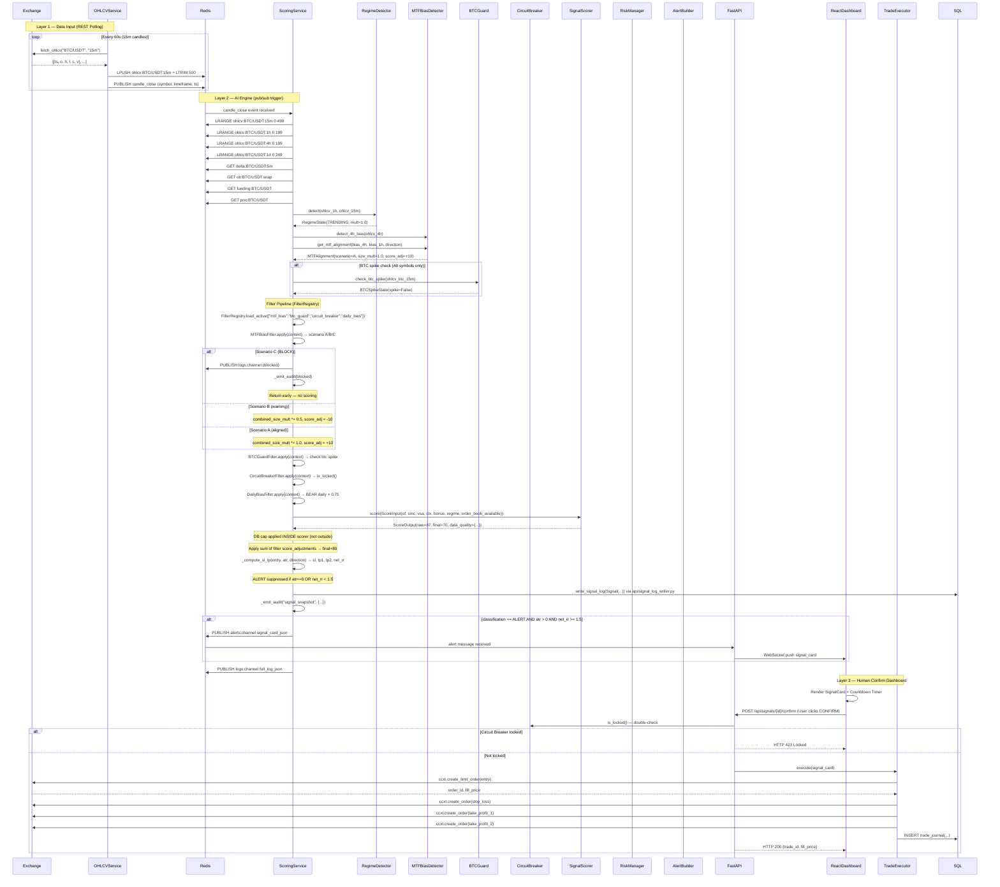
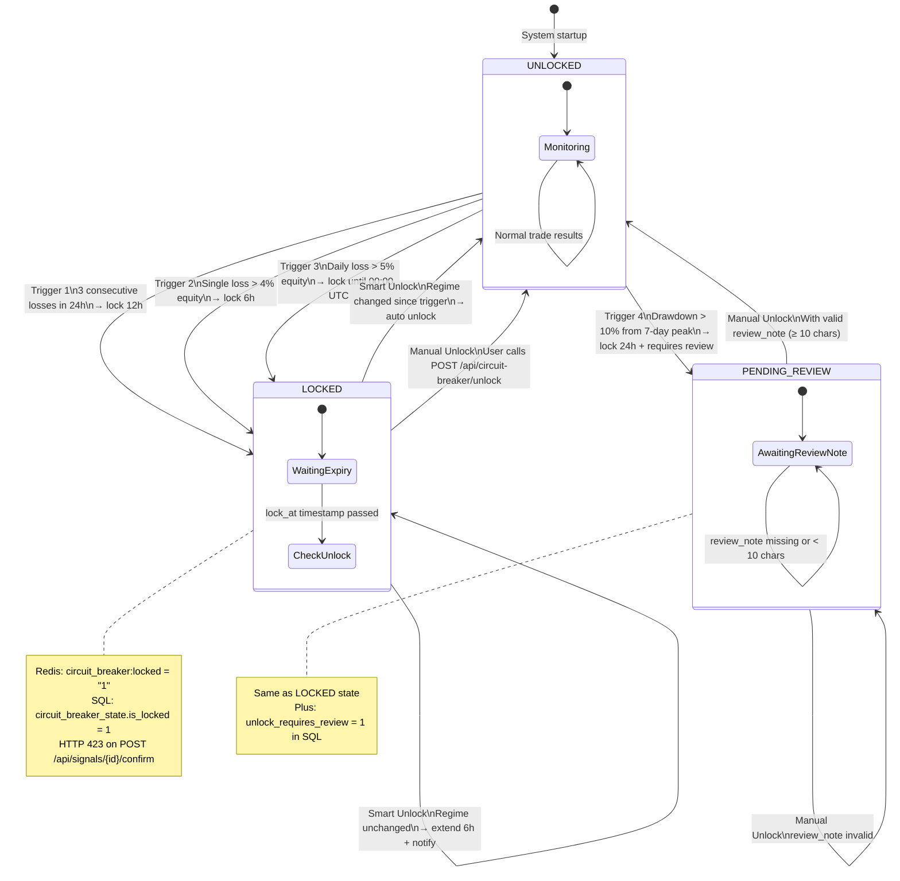
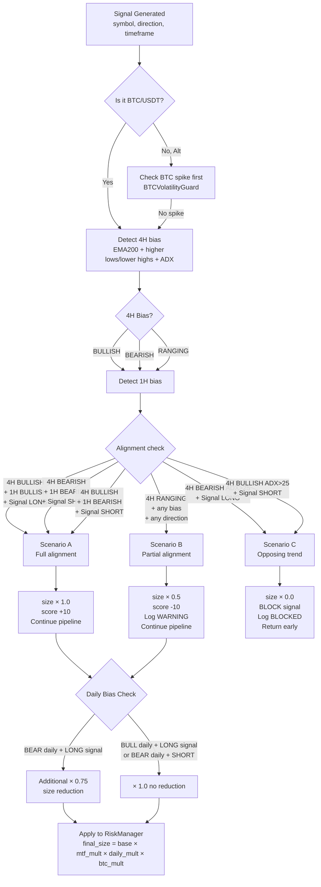
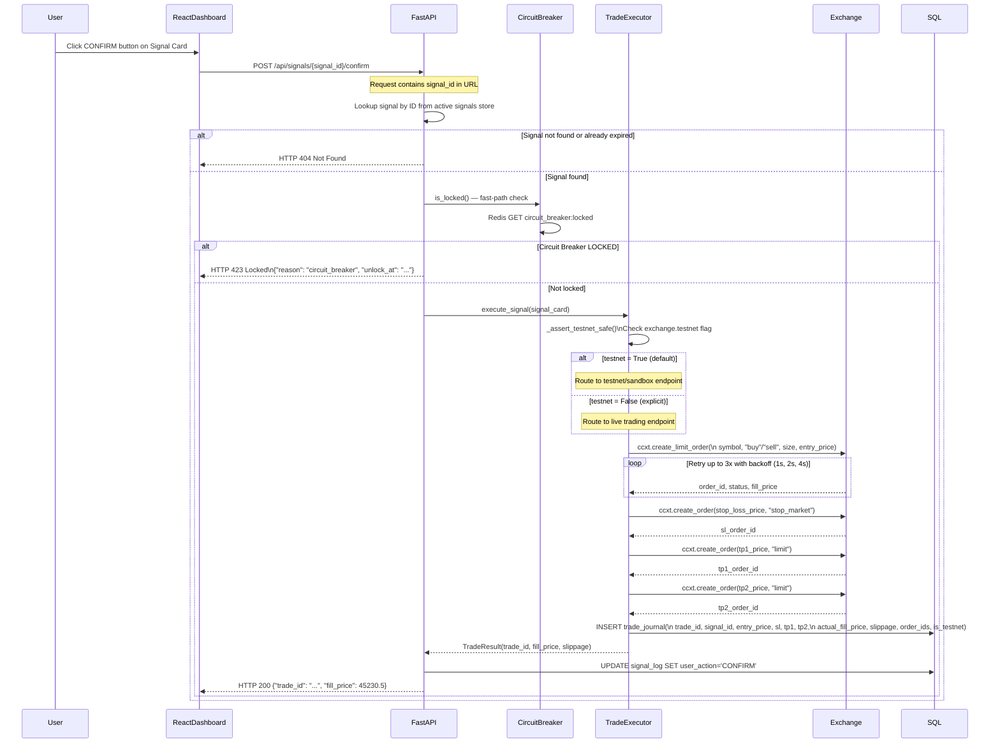
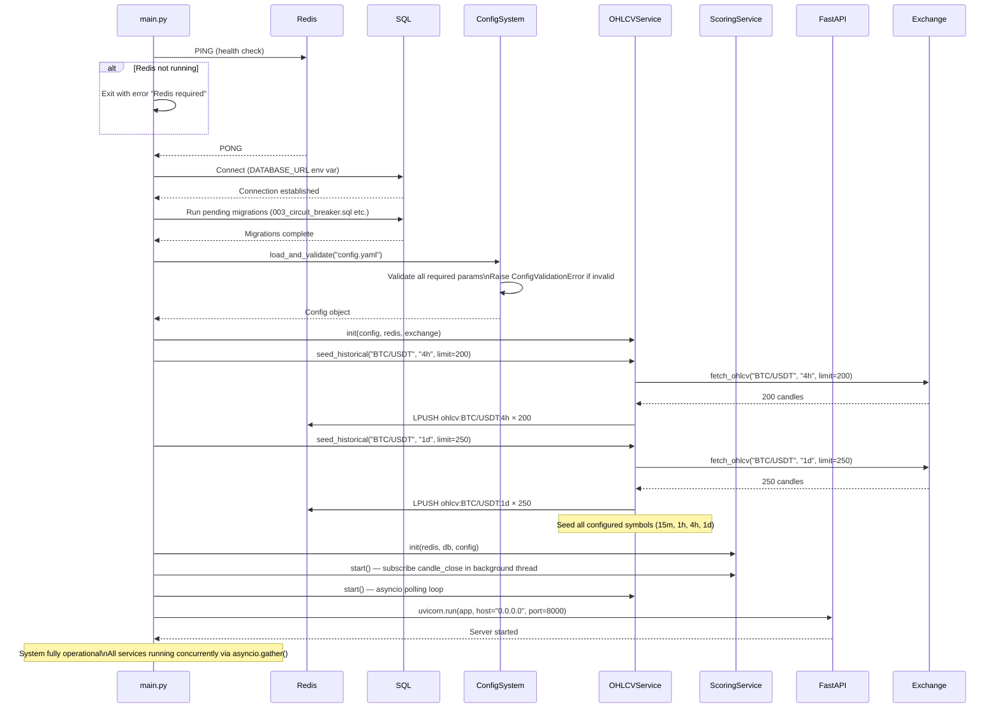

# Phần 3: Data Flow Diagrams — Crypto Trading System

---

## 3.1 Realtime Signal Flow (End-to-End)



---

## 3.2 Candle Close Trigger Flow

```mermaid
sequenceDiagram
    participant OHLCVService
    participant Redis
    participant ScoringThread
    participant AsyncioLoop

    OHLCVService->>OHLCVService: Phát hiện timestamp mới trong fetch_ohlcv response
    OHLCVService->>Redis: LPUSH ohlcv:{sym}:{tf} new_candle_json
    OHLCVService->>Redis: LTRIM ohlcv:{sym}:{tf} 0 499
    OHLCVService->>Redis: PUBLISH candle_close {"symbol": "BTC/USDT", "timeframe": "15m", "close": 45230.5}

    Note over Redis,ScoringThread: Threading model: pub/sub subscribe trong daemon thread

    Redis-->>ScoringThread: Message received (blocking LISTEN in thread)
    ScoringThread->>ScoringThread: Parse {"symbol", "timeframe", "close"}
    ScoringThread->>AsyncioLoop: asyncio.run_coroutine_threadsafe(_run_cycle(sym, tf), loop)

    Note over AsyncioLoop: _run_cycle() coroutine

    AsyncioLoop->>AsyncioLoop: [1] Read OHLCV (15m/1h/4h/1d), OB snap, delta, funding từ Redis
    AsyncioLoop->>AsyncioLoop: [1b] ob_age check: stale nếu updated_at > 60s ago
    AsyncioLoop->>AsyncioLoop: [1c] Snapshot delta → delta_history (RPUSH+LTRIM 96), reset delta="0"
    AsyncioLoop->>AsyncioLoop: [2] Compute ATR(14), ADX(14); regime = RegimeDetector.classify()
    AsyncioLoop->>AsyncioLoop: [3] compute_volume_profile(last 96 candles)
    AsyncioLoop->>AsyncioLoop: [3b] 2-Pass SMC: Pass1 detect direction, Pass2 direction-aware OB
    AsyncioLoop->>AsyncioLoop: [3c] compute_vsa_score(ohlcv, vp, atr, delta)
    AsyncioLoop->>AsyncioLoop: [4] Build filter_context dict
    AsyncioLoop->>AsyncioLoop: [4b] FilterRegistry.load_active → run 4 filters sequentially

    alt Any filter BLOCK
        AsyncioLoop->>Redis: PUBLISH logs:channel (blocked)
        AsyncioLoop->>AsyncioLoop: _emit_audit(blocked_snapshot)
        AsyncioLoop->>AsyncioLoop: Return early
    else All filters pass
        AsyncioLoop->>AsyncioLoop: [5] Compute OF, CTX, Bonus scores
        AsyncioLoop->>AsyncioLoop: [5b] SignalScorer.score(ScoreInput) — OB cap inside scorer
        AsyncioLoop->>AsyncioLoop: [5c] Apply sum filter score_adjustments
        AsyncioLoop->>AsyncioLoop: [6] _compute_sl_tp(entry, atr) → sl, tp1, tp2, net_rr
        AsyncioLoop->>SQL: write_signal_log(Signal) — api/signal_log_writer.py
        AsyncioLoop->>AsyncioLoop: _emit_audit("signal_snapshot")

        alt classification == ALERT AND atr > 0 AND net_rr >= 1.5
            AsyncioLoop->>Redis: PUBLISH alerts:channel (ALERT)
        else score 55-74
            AsyncioLoop->>Redis: PUBLISH logs:channel (WATCH)
        else score < 55
                    AsyncioLoop->>Redis: PUBLISH logs:channel (IGNORE)
                end
            end
            
            AsyncioLoop->>SQL: INSERT signal_log
        end
    end
```

---

## 3.3 Circuit Breaker State Machine



**Mô tả transitions:**

| Transition | Guard | Action |
|------------|-------|--------|
| UNLOCKED → LOCKED (T1) | 3 losses trong Redis `circuit_breaker:recent_losses` list | SQL INSERT, Redis SET TTL=12h+60s, PUBLISH cb:events |
| UNLOCKED → LOCKED (T2) | `loss_pct > config.risk.max_single_loss` | SQL INSERT, Redis SET TTL=6h+60s |
| UNLOCKED → LOCKED (T3) | `daily_loss_pct > config.risk.max_daily_loss_pct` | SQL INSERT, Redis SET TTL đến 00:00 UTC |
| UNLOCKED → PENDING_REVIEW (T4) | `drawdown > 0.10` from 7-day peak | SQL INSERT (unlock_requires_review=1), Redis SET TTL=24h+60s |
| LOCKED → UNLOCKED (Smart) | Lock expired + regime changed | SQL UPDATE (unlocked_by='auto_regime_change'), Redis DEL |
| LOCKED → LOCKED (Extend) | Lock expired + regime unchanged | SQL UPDATE (unlock_at += 6h), Redis SETEX TTL=6h+60s |
| LOCKED → UNLOCKED (Manual) | T1/T2/T3: any review_note | SQL UPDATE (unlocked_by='manual_user'), Redis DEL |
| PENDING_REVIEW → UNLOCKED (Manual) | review_note ≥ 10 chars | SQL UPDATE review_note + unlocked_by |

---

## 3.4 MTF Bias Decision Tree



---

## 3.5 Trade Execution Flow



---

## 3.6 Backtest Flow

```mermaid
flowchart TD
    A[POST /api/backtest/run\nbody: strategy, asset, timeframe, start_date, end_date] --> B[Load config.yaml\nbacktest section]
    
    B --> C[Load historical OHLCV\nfrom SQL / CSV\nstart_date → end_date]
    C --> D[Load historical Funding Rates\nfrom SQL / CSV]
    
    D --> E{Walk-Forward enabled?}
    
    E -->|Yes| F[Partition data\nIn-sample / Out-of-sample windows\nin_sample_days: 90\nout_sample_days: 30\nstep_days: 30]
    E -->|No| G[Single run\nfull date range]
    
    F --> H[For each WF window]
    G --> H
    
    H --> I[For each candle T\nin ascending order]
    
    I --> J[Compute indicators\nATR/RSI/ADX/EMA/BB\non ohlcv index 0..T only]
    
    J --> K[Regime Detector\nADX + ATR on closed candles]
    
    K --> L[Strategy Registry\ngenerate_signals ohlcv index 0..T\nStrict no look-ahead bias]
    
    L --> M{Signal generated?}
    
    M -->|No| N[Next candle T+1]
    M -->|Yes| O[Signal Scorer\ncompute score]
    
    O --> P{Score >= 75?}
    
    P -->|No: WATCH/IGNORE| Q[Log signal\nNext candle T+1]
    P -->|Yes: ALERT| R[Risk Manager\nCheck portfolio heat\nCalculate position size]
    
    R --> S[Simulate fill\nentry_price = ohlcv[T].close\nactual_entry = entry × 1 + slippage_pct]
    
    S --> T[Apply funding rate payments\nDuring hold period]
    
    T --> U{Check SL/TP within candle\nIntra-candle fill check}
    
    U -->|SL hit| V[Record TradeResult\nresult = loss\nexit_price = stop_loss]
    U -->|TP1 hit| W[Record TradeResult\nresult = win\nexit_price = tp1_price]
    U -->|TP2 hit| X[Record TradeResult\nresult = win\nexit_price = tp2_price]
    U -->|Neither| Y[Hold to next candle\nUpdate position monitor]
    
    V --> N
    W --> N
    X --> N
    Y --> N
    
    N --> Z{Last candle?}
    Z -->|No| I
    Z -->|Yes| AA[Compute Metrics]
    
    AA --> AB[Win Rate = wins / total\nProfit Factor = gross_win / gross_loss\nMax Drawdown = max peak-to-trough\nSharpe Ratio = mean returns / std × sqrt365\nRecovery Factor = net_pnl / max_drawdown]
    
    AB --> AC{Walk-Forward?}
    AC -->|Yes, more windows| H
    AC -->|No or last window| AD[Write backtest_results to SQL\nGenerate Benchmark_Table]
    
    AD --> AE[AI Feedback\nIdentify Underperformance Clusters\nWrite optimization suggestions to /logs/]
    
    AE --> AF[Return results\nGET /api/backtest/results]
```

---

## 3.7 System Startup Sequence


