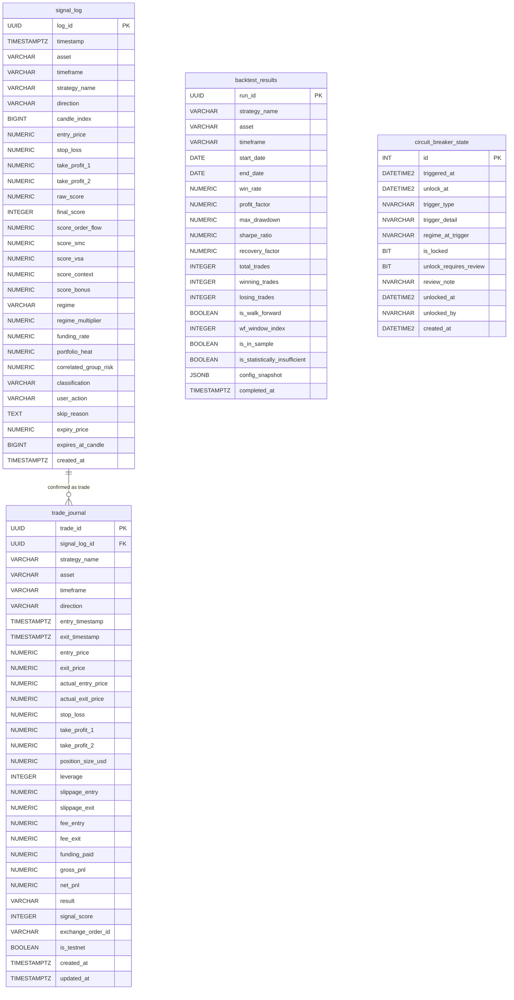

# Phần 4: Database Design Document — Crypto Trading System

---

## 4.1 Entity Relationship Diagram (ERD)



---

## 4.2 Table Specifications

### Table: signal_log

**Mục đích:** Lưu trữ MỌI signal được generate (ALERT + WATCH + IGNORE), bất kể user action. Đây là nguồn dữ liệu chính cho phân tích chiến lược, optimize thresholds và debug.

**Schema:**

| Column | Type | Constraints | Description | Example |
|--------|------|-------------|-------------|---------|
| `log_id` | UUID | PRIMARY KEY, DEFAULT gen_random_uuid() | Unique identifier | `"550e8400-e29b-41d4-a716-446655440000"` |
| `timestamp` | TIMESTAMPTZ | NOT NULL | Thời điểm candle close trigger scoring | `"2024-01-15 09:15:00+00"` |
| `asset` | VARCHAR(20) | NOT NULL | Symbol giao dịch | `"BTC/USDT"` |
| `timeframe` | VARCHAR(5) | NOT NULL | Timeframe trigger | `"15m"` |
| `strategy_name` | VARCHAR(100) | NOT NULL | Tên strategy tạo signal | `"smc_ob_fvg"` |
| `direction` | VARCHAR(5) | NOT NULL, CHECK IN ('long','short') | Hướng giao dịch | `"long"` |
| `candle_index` | BIGINT | NOT NULL | Index của candle trong buffer | `12450` |
| `entry_price` | NUMERIC(20,8) | NULL | Giá entry đề xuất | `45230.50000000` |
| `stop_loss` | NUMERIC(20,8) | NULL | Giá stop loss | `44800.00000000` |
| `take_profit_1` | NUMERIC(20,8) | NULL | TP1 | `46000.00000000` |
| `take_profit_2` | NUMERIC(20,8) | NULL | TP2 | `47500.00000000` |
| `raw_score` | NUMERIC(6,2) | NOT NULL | Raw score trước normalization (0–125) | `87.50` |
| `final_score` | INTEGER | NOT NULL | Final score sau normalization (0–100) | `70` |
| `score_order_flow` | NUMERIC(5,2) | NOT NULL | OrderFlow module score | `0.00` |
| `score_smc` | NUMERIC(5,2) | NOT NULL | SMC module score | `30.00` |
| `score_vsa` | NUMERIC(5,2) | NOT NULL | VSA module score | `20.00` |
| `score_context` | NUMERIC(5,2) | NOT NULL | Context module score | `15.00` |
| `score_bonus` | NUMERIC(5,2) | NOT NULL | Confluence bonus | `12.50` |
| `regime` | VARCHAR(20) | NOT NULL | Market regime tại thời điểm | `"TRENDING"` |
| `regime_multiplier` | NUMERIC(4,2) | NOT NULL | Score multiplier áp dụng | `1.00` |
| `funding_rate` | NUMERIC(10,6) | NOT NULL | Funding rate tại thời điểm | `0.000125` |
| `portfolio_heat` | NUMERIC(6,4) | NOT NULL | Portfolio heat % | `0.0400` |
| `correlated_group_risk` | NUMERIC(6,4) | NOT NULL | Correlated group risk % | `0.0200` |
| `classification` | VARCHAR(10) | NOT NULL, CHECK IN ('ALERT','WATCH','IGNORE') | Final classification | `"ALERT"` |
| `user_action` | VARCHAR(10) | NULL, CHECK IN ('CONFIRM','SKIP','EXPIRED','IGNORE',NULL) | Hành động của trader | `"CONFIRM"` |
| `skip_reason` | TEXT | NULL | Lý do skip (nếu có) | `"Too risky"` |
| `expiry_price` | NUMERIC(20,8) | NULL | Giá khi signal expire | `45800.00000000` |
| `expires_at_candle` | BIGINT | NOT NULL | Candle index hết hạn | `12465` |
| `created_at` | TIMESTAMPTZ | NOT NULL, DEFAULT NOW() | Insert timestamp | `"2024-01-15 09:15:01+00"` |

**Indexes:**

| Index Name | Columns | Type | Purpose |
|------------|---------|------|---------|
| `idx_signal_log_asset_ts` | (asset, timestamp) | B-tree | Query signals by asset và time range |
| `idx_signal_log_classification` | (classification) | B-tree | Filter ALERT/WATCH/IGNORE |
| `idx_signal_log_strategy` | (strategy_name) | B-tree | Per-strategy analytics |
| `idx_signal_log_user_action` | (user_action) | B-tree | Track CONFIRM/SKIP rates |

**Query Patterns:**

```sql
-- 1. Lấy tất cả ALERT signals trong 7 ngày qua
SELECT * FROM signal_log
WHERE classification = 'ALERT'
  AND timestamp >= NOW() - INTERVAL '7 days'
ORDER BY timestamp DESC;

-- 2. Win rate theo strategy
SELECT strategy_name,
       COUNT(*) FILTER (WHERE user_action = 'CONFIRM') AS confirmed,
       COUNT(*) FILTER (WHERE classification = 'ALERT') AS total_alerts
FROM signal_log
GROUP BY strategy_name;

-- 3. Phân tích score distribution
SELECT
    CASE
        WHEN final_score >= 75 THEN 'ALERT'
        WHEN final_score >= 55 THEN 'WATCH'
        ELSE 'IGNORE'
    END AS classification,
    COUNT(*),
    AVG(final_score),
    AVG(score_order_flow) AS avg_of,
    AVG(score_smc) AS avg_smc
FROM signal_log
WHERE asset = 'BTC/USDT'
  AND timestamp >= NOW() - INTERVAL '30 days'
GROUP BY 1;

-- 4. Signals bị block bởi Circuit Breaker (score >= 75 nhưng không có user_action)
SELECT * FROM signal_log
WHERE final_score >= 75
  AND user_action IS NULL
  AND created_at >= NOW() - INTERVAL '24 hours';
```

**Data Volume:** ~100–500 rows/day (phụ thuộc vào số symbols và timeframes được monitor). Retention: không giới hạn (phân tích lịch sử).

---

### Table: trade_journal

**Mục đích:** Lưu trữ mọi lệnh đã được CONFIRM với thông tin thực tế (fill price, slippage, PnL). Source of truth cho performance analytics.

**Schema:**

| Column | Type | Constraints | Description | Example |
|--------|------|-------------|-------------|---------|
| `trade_id` | UUID | PRIMARY KEY | Unique trade ID | `"660e8400-..."` |
| `signal_log_id` | UUID | FK → signal_log(log_id), NULL | Link về signal gốc | `"550e8400-..."` |
| `strategy_name` | VARCHAR(100) | NOT NULL | Strategy tạo signal | `"smc_ob_fvg"` |
| `asset` | VARCHAR(20) | NOT NULL | Symbol | `"BTC/USDT"` |
| `timeframe` | VARCHAR(5) | NOT NULL | Timeframe | `"15m"` |
| `direction` | VARCHAR(5) | NOT NULL, CHECK IN ('long','short') | Hướng | `"long"` |
| `entry_timestamp` | TIMESTAMPTZ | NOT NULL | Thời điểm vào lệnh | `"2024-01-15 09:16:00+00"` |
| `exit_timestamp` | TIMESTAMPTZ | NULL | Thời điểm thoát lệnh | `"2024-01-15 11:30:00+00"` |
| `entry_price` | NUMERIC(20,8) | NOT NULL | Giá entry theo signal | `45230.50000000` |
| `exit_price` | NUMERIC(20,8) | NULL | Giá exit theo SL/TP | `46000.00000000` |
| `actual_entry_price` | NUMERIC(20,8) | NOT NULL | Fill price thực tế | `45232.10000000` |
| `actual_exit_price` | NUMERIC(20,8) | NULL | Exit fill price thực tế | `46001.50000000` |
| `stop_loss` | NUMERIC(20,8) | NOT NULL | Giá stop loss | `44800.00000000` |
| `take_profit_1` | NUMERIC(20,8) | NOT NULL | TP1 | `46000.00000000` |
| `take_profit_2` | NUMERIC(20,8) | NULL | TP2 | `47500.00000000` |
| `position_size_usd` | NUMERIC(20,4) | NOT NULL | Size vào lệnh (USD) | `100.0000` |
| `leverage` | INTEGER | NOT NULL, DEFAULT 1 | Leverage | `5` |
| `slippage_entry` | NUMERIC(20,8) | NOT NULL, DEFAULT 0 | Slippage khi vào | `1.60000000` |
| `slippage_exit` | NUMERIC(20,8) | NOT NULL, DEFAULT 0 | Slippage khi thoát | `1.50000000` |
| `fee_entry` | NUMERIC(20,8) | NOT NULL, DEFAULT 0 | Phí vào lệnh | `0.04523000` |
| `fee_exit` | NUMERIC(20,8) | NOT NULL, DEFAULT 0 | Phí thoát lệnh | `0.04600000` |
| `funding_paid` | NUMERIC(20,8) | NOT NULL, DEFAULT 0 | Funding rate đã trả | `0.01200000` |
| `gross_pnl` | NUMERIC(20,8) | NULL | PnL gộp (trước phí) | `76.90000000` |
| `net_pnl` | NUMERIC(20,8) | NULL | PnL ròng (sau phí) | `76.75677000` |
| `result` | VARCHAR(4) | NULL, CHECK IN ('win','loss','be') | Kết quả | `"win"` |
| `signal_score` | INTEGER | NOT NULL, CHECK BETWEEN 0 AND 100 | Score tại thời điểm tạo | `80` |
| `exchange_order_id` | VARCHAR(100) | NULL | Order ID từ exchange | `"12345678901"` |
| `is_testnet` | BOOLEAN | NOT NULL, DEFAULT TRUE | Testnet hay live | `false` |
| `created_at` | TIMESTAMPTZ | NOT NULL, DEFAULT NOW() | Insert time | `"2024-01-15 09:16:01+00"` |
| `updated_at` | TIMESTAMPTZ | NOT NULL, DEFAULT NOW() | Last update time | `"2024-01-15 11:30:05+00"` |

**Indexes:**

| Index Name | Columns | Type | Purpose |
|------------|---------|------|---------|
| `idx_trade_journal_asset` | (asset) | B-tree | Filter by symbol |
| `idx_trade_journal_strategy` | (strategy_name) | B-tree | Per-strategy P&L |
| `idx_trade_journal_entry_ts` | (entry_timestamp) | B-tree | Time range queries |
| `idx_trade_journal_result` | (result) | B-tree | Win/loss filtering |

**Query Patterns:**

```sql
-- 1. Analytics: win rate và profit factor theo asset
SELECT asset,
       COUNT(*) AS total,
       COUNT(*) FILTER (WHERE result = 'win') AS wins,
       ROUND(COUNT(*) FILTER (WHERE result = 'win')::NUMERIC / COUNT(*), 4) AS win_rate,
       SUM(net_pnl) FILTER (WHERE net_pnl > 0) / 
           ABS(SUM(net_pnl) FILTER (WHERE net_pnl < 0)) AS profit_factor
FROM trade_journal
WHERE is_testnet = false
GROUP BY asset;

-- 2. Max drawdown calculation
WITH equity_curve AS (
    SELECT entry_timestamp,
           SUM(net_pnl) OVER (ORDER BY entry_timestamp) AS cumulative_pnl
    FROM trade_journal WHERE is_testnet = false
)
SELECT MIN(cumulative_pnl - MAX(cumulative_pnl) OVER (ORDER BY entry_timestamp)) AS max_drawdown
FROM equity_curve;

-- 3. Slippage analysis
SELECT asset,
       AVG(slippage_entry) AS avg_entry_slippage,
       AVG(slippage_exit) AS avg_exit_slippage,
       AVG(fee_entry + fee_exit) AS avg_total_fees
FROM trade_journal
GROUP BY asset;
```

**Data Volume:** ~5–20 trades/week (semi-auto, trader confirms manually). Retention: không giới hạn.

---

### Table: backtest_results

**Mục đích:** Lưu kết quả mỗi lần chạy backtest, bao gồm walk-forward windows. Dùng để so sánh strategies và tìm best parameters.

**Schema:**

| Column | Type | Constraints | Description | Example |
|--------|------|-------------|-------------|---------|
| `run_id` | UUID | PRIMARY KEY | Unique backtest run ID | `"770e8400-..."` |
| `strategy_name` | VARCHAR(100) | NOT NULL | Strategy name | `"smc_ob_fvg"` |
| `asset` | VARCHAR(20) | NOT NULL | Symbol backtested | `"BTC/USDT"` |
| `timeframe` | VARCHAR(5) | NOT NULL | Timeframe | `"15m"` |
| `start_date` | DATE | NOT NULL | Backtest start | `"2024-01-01"` |
| `end_date` | DATE | NOT NULL | Backtest end | `"2024-12-31"` |
| `win_rate` | NUMERIC(6,4) | NULL | Win rate [0.0–1.0] | `0.6250` |
| `profit_factor` | NUMERIC(8,4) | NULL | Gross win / gross loss | `2.1500` |
| `max_drawdown` | NUMERIC(6,4) | NULL | Max drawdown % | `0.0850` |
| `sharpe_ratio` | NUMERIC(8,4) | NULL | Annualized Sharpe | `1.8200` |
| `recovery_factor` | NUMERIC(8,4) | NULL | Net PnL / max drawdown | `3.4500` |
| `total_trades` | INTEGER | NULL | Tổng số lệnh mô phỏng | `48` |
| `winning_trades` | INTEGER | NULL | Lệnh thắng | `30` |
| `losing_trades` | INTEGER | NULL | Lệnh thua | `18` |
| `is_walk_forward` | BOOLEAN | NOT NULL, DEFAULT FALSE | Có dùng walk-forward không | `true` |
| `wf_window_index` | INTEGER | NULL | Index của WF window (0-based) | `2` |
| `is_in_sample` | BOOLEAN | NULL | In-sample hay out-of-sample | `false` |
| `is_statistically_insufficient` | BOOLEAN | NOT NULL, DEFAULT FALSE | Quá ít trades (< 30) | `false` |
| `config_snapshot` | JSONB | NOT NULL | Snapshot config.yaml tại thời điểm chạy | `{...}` |
| `completed_at` | TIMESTAMPTZ | NOT NULL, DEFAULT NOW() | Khi nào chạy xong | `"2024-01-15 10:00:00+00"` |

**Indexes:**

| Index Name | Columns | Type | Purpose |
|------------|---------|------|---------|
| `idx_backtest_strategy_asset` | (strategy_name, asset) | B-tree | Benchmark table queries |
| `idx_backtest_completed_at` | (completed_at) | B-tree | Recent runs first |

**Query Patterns:**

```sql
-- 1. Benchmark table: best strategy per asset
SELECT strategy_name, asset, timeframe,
       win_rate, profit_factor, sharpe_ratio, max_drawdown,
       total_trades
FROM backtest_results
WHERE is_walk_forward = true AND is_in_sample = false
ORDER BY profit_factor DESC;

-- 2. Walk-forward stability check (in-sample vs out-of-sample degradation)
SELECT wf_window_index,
       MAX(profit_factor) FILTER (WHERE is_in_sample = true) AS is_pf,
       MAX(profit_factor) FILTER (WHERE is_in_sample = false) AS oos_pf
FROM backtest_results
WHERE strategy_name = 'smc_ob_fvg' AND asset = 'BTC/USDT'
GROUP BY wf_window_index
ORDER BY wf_window_index;
```

---

### Table: circuit_breaker_state

**Mục đích:** Lưu lịch sử mỗi lần Circuit Breaker được kích hoạt và unlock. Dùng để audit, smart unlock (so sánh regime), và API status endpoint.

**Schema:**

| Column | Type | Constraints | Description | Example |
|--------|------|-------------|-------------|---------|
| `id` | INT | IDENTITY(1,1) PRIMARY KEY | Auto-increment ID | `1` |
| `triggered_at` | DATETIME2 | NOT NULL, DEFAULT GETUTCDATE() | Khi nào bị lock | `"2024-01-15 09:00:00"` |
| `unlock_at` | DATETIME2 | NOT NULL | Khi nào tự động unlock | `"2024-01-15 21:00:00"` |
| `trigger_type` | NVARCHAR(50) | NOT NULL | Loại trigger | `"CONSECUTIVE_LOSSES"` |
| `trigger_detail` | NVARCHAR(500) | NULL | Chi tiết lý do | `"3 losses: -2%, -3%, -4.5% in 24h"` |
| `regime_at_trigger` | NVARCHAR(20) | NOT NULL, DEFAULT 'UNKNOWN' | Regime tại thời điểm lock | `"TRENDING"` |
| `is_locked` | BIT | NOT NULL, DEFAULT 1 | Đang locked? | `1` |
| `unlock_requires_review` | BIT | NOT NULL, DEFAULT 0 | Cần review note? (Trigger 4) | `0` |
| `review_note` | NVARCHAR(1000) | NULL | Ghi chú của trader khi unlock | `"Reviewed market conditions..."` |
| `unlocked_at` | DATETIME2 | NULL | Khi nào được unlock | `"2024-01-15 21:00:00"` |
| `unlocked_by` | NVARCHAR(100) | NULL | Ai/cơ chế nào unlock | `"auto_regime_change"` |
| `created_at` | DATETIME2 | NOT NULL, DEFAULT GETUTCDATE() | Insert time | `"2024-01-15 09:00:00"` |

**Trigger Type Values:**

| Value | Trigger | Lock Duration |
|-------|---------|---------------|
| `CONSECUTIVE_LOSSES` | T1: 3 thua liên tiếp | 12h |
| `LOSS_MAGNITUDE` | T2: Thua > 4% equity | 6h |
| `DAILY_LOSS_CAP` | T3: Thua > 5%/day | Đến 00:00 UTC |
| `DRAWDOWN_FROM_PEAK` | T4: Drawdown > 10% từ peak | 24h + review |

**unlocked_by Values:**

| Value | Ý nghĩa |
|-------|---------|
| `auto_regime_change` | Smart unlock: regime thay đổi |
| `manual_user` | Trader tự unlock qua API |
| `timer_expired` | Chỉ timer hết, không check regime |

**Indexes:**

```sql
CREATE INDEX idx_cb_is_locked ON circuit_breaker_state (is_locked, unlock_at);
```

**Query Patterns:**

```sql
-- 1. Lấy lock state hiện tại
SELECT * FROM circuit_breaker_state
WHERE is_locked = 1
ORDER BY triggered_at DESC
LIMIT 1;

-- 2. Lịch sử lock/unlock
SELECT trigger_type, triggered_at, unlock_at, unlocked_at, unlocked_by, regime_at_trigger
FROM circuit_breaker_state
ORDER BY triggered_at DESC;

-- 3. Circuit Breaker frequency analysis
SELECT trigger_type, COUNT(*) AS count,
       AVG(DATEDIFF(MINUTE, triggered_at, COALESCE(unlocked_at, unlock_at))) AS avg_lock_minutes
FROM circuit_breaker_state
WHERE triggered_at >= DATEADD(DAY, -30, GETUTCDATE())
GROUP BY trigger_type;
```

---

## 4.3 Redis Key Catalog

| Key Pattern | Type | TTL | Format | Writer | Readers | Description |
|-------------|------|-----|--------|--------|---------|-------------|
| `ohlcv:{sym}:{tf}` | List | Không | JSON array items: `{"ts":int,"o":float,"h":float,"l":float,"c":float,"v":float}` | OHLCVService | ScoringService, MTFBiasDetector | Ring buffer OHLCV — 15m:500, 4h:200, 1d:250 |
| `delta:{sym}:5m` | String | Không | float as string | DeltaService | OrderFlowAnalysis | Cumulative delta nến hiện tại (reset mỗi nến close) |
| `delta_history:{sym}` | List | 25h | JSON floats | DeltaService | OrderFlowAnalysis | 96 giá trị delta 24h dùng cho Dynamic Threshold |
| `ob:{sym}:snap` | String | Không | JSON: `{"bid_stack":float,"ask_stack":float,"mid":float,"absorption":bool,"ts":int}` | OrderBookService | OrderFlowAnalysis | Order Book snapshot |
| `funding:{sym}` | String | Không | JSON: `{"rate":float,"next_ts":int,"ts":int}` | FundingService | ContextFilter | Funding rate hiện tại |
| `poc:{sym}` | String | Không | JSON: `{"poc":float,"vah":float,"val":float,"ts":int}` | VSAModule (volume_profile) | VSAModule | Point of Control từ Volume Profile |
| `regime:{sym}` | String | Không | JSON: `{"regime":str,"multiplier":float,"adx":float,"atr":float,"ts":int}` | RegimeDetector | ScoringService, CircuitBreaker | Market regime state |
| `daily_bias:{sym}` | String | 4h | JSON: `{"bias":"BULL"\|"BEAR"\|"NEUTRAL","ts":int}` | MTFBiasDetector | MTFBiasDetector | Daily bias (TTL 4h = refresh khi EMA200 update) |
| `btc_guard:spike` | String | cooldown+60s | JSON: `{"direction":"dump"\|"pump","magnitude":float,"cooldown_until":int}` | BTCVolatilityGuard | BTCVolatilityGuard, ScoringService | BTC spike state |
| `circuit_breaker:locked` | String | lock_duration+60s | `"1"` hoặc `"0"` | CircuitBreaker | CircuitBreaker.is_locked(), FastAPI | Fast-path lock cache |
| `circuit_breaker:recent_losses` | List | 24h | JSON trade result items | CircuitBreaker | CircuitBreaker | Consecutive loss tracking (T1) |
| `circuit_breaker:7day_peak` | String | 7 days | float as string | CircuitBreaker | CircuitBreaker | Equity peak 7 ngày (T4) |

---

## 4.4 Pub/Sub Channel Catalog

| Channel | Publisher | Subscribers | Message Format | Trigger |
|---------|-----------|-------------|----------------|---------|
| `candle_close` | OHLCVService | ScoringService (background thread) | `{"symbol":"BTC/USDT","timeframe":"15m","timestamp":1700000000}` | Khi phát hiện candle mới đóng |
| `alerts:channel` | ScoringService | FastAPI WebSocket handler (/ws/alerts) | Full SignalCard JSON (xem Phần 5) | Khi signal score ≥ 75 và risk check pass |
| `logs:channel` | ScoringService | FastAPI WebSocket handler (/ws/logs) | Full scoring log JSON (ALERT + WATCH + IGNORE) | Mỗi candle scoring (luôn luôn) |
| `cancel_all_alerts` | BTCVolatilityGuard | FastAPI (cancel pending Signal Cards) | `{"reason":"btc_dump","ts":1700000000,"symbol":"BTC/USDT"}` | BTC dump spike detected (>2%) |
| `btc_spike` | BTCVolatilityGuard | FastAPI WebSocket (frontend notification) | `{"direction":"dump"\|"pump","magnitude":0.025,"cooldown_until":1700001800}` | BTC spike detected |
| `circuit_breaker:events` | CircuitBreaker | FastAPI WebSocket (frontend notification) | `{"event":"locked"\|"unlocked"\|"extended","trigger":"CONSECUTIVE_LOSSES","unlock_at":1700043600}` | Lock/unlock/extend CB state |

**Ghi chú về Message Format cho alerts:channel:**

```json
{
  "signal_id": "550e8400-e29b-41d4-a716-446655440000",
  "asset": "BTC/USDT",
  "timeframe": "15m",
  "direction": "long",
  "entry_price": 45230.5,
  "stop_loss": 44800.0,
  "take_profit_1": 46000.0,
  "take_profit_2": 47500.0,
  "gross_rr": 1.71,
  "net_rr": 1.68,
  "final_score": 80,
  "score_breakdown": {
    "order_flow": 0.0,
    "smc": 30.0,
    "vsa": 20.0,
    "context": 15.0,
    "bonus": 12.5
  },
  "regime": "TRENDING",
  "regime_multiplier": 1.0,
  "expires_at_candle": 12465,
  "mtf_scenario": "A",
  "mtf_warning": null,
  "bias_4h": "BULLISH",
  "daily_bias": "BULL",
  "size_multiplier": 1.0,
  "data_quality": "limited",
  "ob_warning": "Order book unavailable, score capped at 60",
  "timestamp": "2024-01-15T09:15:00Z"
}
```
