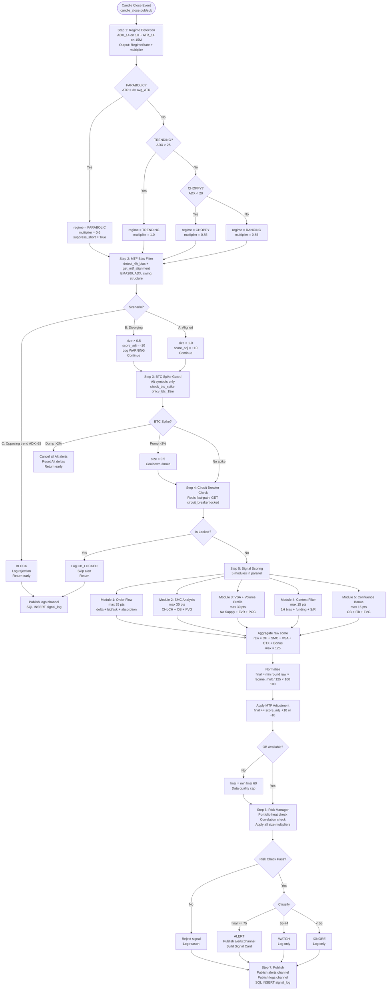

# Phần 7: Scoring Algorithm Deep Dive — Crypto Trading System

---

## 7.1 Scoring Pipeline Flowchart



---

## 7.2 Module Scoring Specifications

### Module 1: Order Flow Analysis (max 35 pts)

**Mục đích:** Đo lường áp lực mua/bán của tổ chức thông qua Cumulative Delta, Bid/Ask Stack dominance, và Absorption.

**Scoring Rules:**

| Condition | Points | Implementation | Notes |
|-----------|--------|----------------|-------|
| `delta > dynamic_threshold` | +15 | `order_flow.py: L45-50` | Institutional buying pressure |
| `bid_stack > ask_stack × 2.0` | +10 | `order_flow.py: L52-55` | Bid chiếm ưu thế tại S/R zone |
| `absorption == True` | +10 | `order_flow.py: L57-60` | Volume lớn, giá không sụt |
| **MAX** | **35** | `min(score, 35.0)` | |

**Pseudocode:**
```python
def compute_order_flow_score(delta, bid_stack, ask_stack, absorption, delta_history) -> float:
    score = 0.0
    threshold = compute_dynamic_delta_threshold(delta_history)
    
    # Institutional buying pressure
    if delta > threshold:
        score += 15.0
    
    # Bid stack dominance at key level
    if bid_stack > 0 and ask_stack > 0:
        if bid_stack > ask_stack * 2.0:
            score += 10.0
    
    # Absorption: large volume without price decline
    if absorption:
        score += 10.0
    
    return min(score, 35.0)
```

**Edge Cases:**
- `delta = 0` (Trade Tape chưa chạy) → 0/15 pts — thiếu data
- `bid_stack = ask_stack = 0` (OB chưa chạy) → 0/10 pts — thiếu data
- `delta_history < 10 points` → fallback threshold = 1000.0 (conservative)

**Data Dependencies:**
- Redis `delta:{sym}:5m` → delta value
- Redis `delta_history:{sym}` → 96 giá trị 24h → dynamic threshold
- Redis `ob:{sym}:snap` → bid_stack, ask_stack, absorption

---

### Module 2: SMC Analysis (max 30 pts)

**Mục đích:** Phân tích Smart Money Concepts: CHoCH (đảo chiều xác nhận), Order Block (vùng tổ chức đặt lệnh), Fair Value Gap (vùng imbalance).

**Scoring Rules:**

| Condition | Points | Implementation | Notes |
|-----------|--------|----------------|-------|
| CHoCH aligned with 1H bias | +10 | `smc.py: L80-95` | 15m swing break + 1H bias đồng thuận |
| Order Block retest | +10 | `smc.py: L100-120` | Giá test lại vùng OB gần nhất |
| FVG midpoint touched | +10 | `smc.py: L125-140` | Giá chạm midpoint = (high[1]+low[3])/2 |
| **MAX** | **30** | `min(score, 30.0)` | |

**Pseudocode:**
```python
def compute_smc_score(ohlcv_15m, ohlcv_1h, signal_direction) -> SMCResult:
    score = 0.0
    
    # CHoCH: 15m swing break aligned with 1H bias
    choch = detect_choch(ohlcv_15m, ohlcv_1h)
    htf_bias = detect_htf_bias(ohlcv_1h)
    if choch and htf_bias_aligned(htf_bias, signal_direction):
        score += 10.0
    
    # Order Block retest
    obs = find_order_block(ohlcv_15m, atr_multiplier=1.5, max_obs=3)
    current_price = ohlcv_15m.iloc[-1]["close"]
    for ob in obs:
        if ob.low <= current_price <= ob.high:
            score += 10.0
            break  # chỉ tính 1 lần dù nhiều OB
    
    # Fair Value Gap midpoint
    fvg = find_fvg(ohlcv_15m)
    if fvg is not None:
        midpoint = (fvg.high + fvg.low) / 2
        if abs(current_price - midpoint) / midpoint <= 0.001:  # within 0.1%
            score += 10.0
    
    return SMCResult(score=min(score, 30.0), order_blocks=obs, fvg=fvg)
```

**CHoCH Detection:**
```python
def detect_choch(ohlcv_15m, ohlcv_1h) -> bool:
    # Bullish CHoCH: price breaks above last swing high on 15m
    # + 1H bias is BULLISH
    last_swing_high = ohlcv_15m["high"].iloc[-20:].max()
    current_close = ohlcv_15m.iloc[-1]["close"]
    return current_close > last_swing_high
```

**Order Block Detection (Fib prioritization):**
```python
def find_order_block(ohlcv, atr_multiplier=1.5, max_obs=3) -> List[OrderBlock]:
    obs = []
    # Tìm bearish nến trước impulse bullish lớn
    for i in range(len(ohlcv) - 20, len(ohlcv) - 2):
        candle = ohlcv.iloc[i]
        if is_bearish(candle) and is_impulse_following(ohlcv.iloc[i+1:], atr_multiplier):
            ob = OrderBlock(high=candle.high, low=candle.low, index=i)
            obs.append(ob)
    
    # Sort by Fibonacci alignment: 61.8% > 50% > 38.2% > proximity
    swing_high = ohlcv["high"].iloc[-50:].max()
    swing_low = ohlcv["low"].iloc[-50:].min()
    
    def fib_priority(ob):
        fib_618 = swing_low + (swing_high - swing_low) * 0.618
        fib_500 = swing_low + (swing_high - swing_low) * 0.500
        fib_382 = swing_low + (swing_high - swing_low) * 0.382
        mid = (ob.high + ob.low) / 2
        if abs(mid - fib_618) / fib_618 <= 0.002: return 0
        if abs(mid - fib_500) / fib_500 <= 0.002: return 1
        if abs(mid - fib_382) / fib_382 <= 0.002: return 2
        return 3  # sort by proximity
    
    return sorted(obs, key=fib_priority)[:max_obs]
```

**Edge Cases:**
- Không có OB → smc_score = 0 (CHoCH có thể vẫn cho 10pts)
- Multiple OB retesting → chỉ tính +10 một lần
- FVG tại multiple levels → chỉ tính level gần entry nhất

---

### Module 3: VSA + Volume Profile (max 30 pts)

**Mục đích:** Volume Spread Analysis để xác định No Supply, Effort vs Result. Volume Profile cho biết vùng POC (giá quan trọng nhất).

**Scoring Rules:**

| Condition | Points | Implementation | Notes |
|-----------|--------|----------------|-------|
| No Supply: `pullback_vol / impulse_vol < 0.40` | +10 | `vsa.py: L30-40` | Không có áp lực bán |
| Effort vs Result: ratio < 0.50 AND small price range | +10 | `vsa.py: L42-52` | Volume thấp nhưng giá giữ vững |
| Entry within ±0.3% of POC | +10 | `vsa.py: L55-62` | Vùng giá quan trọng nhất |
| Entry within ±0.3% of VAH or VAL | +6 | `vsa.py: L64-70` | Biên giá trị (fallback) |
| **MAX** | **30** | `min(score, 30.0)` | |

**Pseudocode:**
```python
def compute_vsa_score(ohlcv, poc, vah, val) -> float:
    score = 0.0
    entry = ohlcv.iloc[-1]["close"]
    
    # Identify impulse candle (3 candles back) and current pullback
    impulse_vol = ohlcv.iloc[-3]["volume"]
    pullback_vol = ohlcv.iloc[-1]["volume"]
    ratio = pullback_vol / impulse_vol if impulse_vol > 0 else 1.0
    
    # No Supply
    if ratio < 0.40:
        score += 10.0
    
    # Effort vs Result
    price_change = abs(ohlcv.iloc[-1]["close"] - ohlcv.iloc[-1]["open"])
    avg_range = (ohlcv["high"].iloc[-20:] - ohlcv["low"].iloc[-20:]).mean()
    if ratio < 0.50 and price_change < 0.3 * avg_range:
        score += 10.0
    
    # Volume Profile POC check
    if poc > 0:
        if abs(entry - poc) / poc <= 0.003:      # ±0.3%
            score += 10.0
        elif vah > 0 and val > 0:
            if abs(entry - vah) / vah <= 0.003 or abs(entry - val) / val <= 0.003:
                score += 6.0
    
    return min(score, 30.0)
```

**Volume Profile Computation:**
```python
def compute_volume_profile(ohlcv_1m, bins=100) -> dict:
    price_bins = pd.cut(ohlcv_1m["close"], bins=bins)
    vol_by_price = ohlcv_1m.groupby(price_bins)["volume"].sum()
    
    poc_bin = vol_by_price.idxmax()
    poc = (poc_bin.left + poc_bin.right) / 2
    
    # Value Area: 70% of total volume
    total_vol = vol_by_price.sum()
    sorted_bins = vol_by_price.sort_values(ascending=False)
    cumvol = 0.0
    value_area_bins = []
    for bin_interval, vol in sorted_bins.items():
        cumvol += vol
        value_area_bins.append(bin_interval)
        if cumvol >= total_vol * 0.70:
            break
    
    vah = max(b.right for b in value_area_bins)
    val = min(b.left for b in value_area_bins)
    return {"poc": poc, "vah": vah, "val": val}
```

**Edge Cases:**
- `poc = 0` (Volume Profile chưa được tính) → POC pts = 0
- `impulse_vol = 0` (mảng volume toàn 0) → ratio = 1.0 → No Supply = False
- Giá tại cả POC và VAH → chỉ tính POC (+10), không cộng thêm VAH (+6)

---

### Module 4: Context Filter (max 15 pts)

**Mục đích:** Kiểm tra ngữ cảnh high-timeframe: 1H trend alignment, funding rate neutrality, khoảng cách với S/R.

**Scoring Rules:**

| Condition | Points | Implementation | Notes |
|-----------|--------|----------------|-------|
| 1H bias aligned với signal direction | +8 | `context.py: L25-40` | Tránh trade ngược xu hướng lớn |
| `\|funding_rate\| ≤ 0.0005 (±0.05%)` | +4 | `context.py: L42-46` | Thị trường cân bằng |
| `nearest_sr_distance ≥ 0.5%` | +3 | `context.py: L48-52` | Không vào giữa không khí |
| **MAX** | **15** | `min(score, 15.0)` | |

**Pseudocode:**
```python
def compute_context_score(ohlcv_1h, funding_rate, nearest_sr_distance_pct, signal_direction) -> float:
    score = 0.0
    
    # 1H bias alignment
    htf_bias = _detect_htf_bias(ohlcv_1h)
    if (signal_direction == "long" and htf_bias == "BULLISH") or \
       (signal_direction == "short" and htf_bias == "BEARISH"):
        score += 8.0
    
    # Funding rate filter
    if abs(funding_rate) <= 0.0005:
        score += 4.0
    
    # Distance from S/R
    if nearest_sr_distance_pct >= 0.005:
        score += 3.0
    
    return min(score, 15.0)
```

**1H Bias Detection:**
```python
def _detect_htf_bias(ohlcv_1h) -> str:
    # Bullish: price > EMA200 + recent higher lows
    ema200 = compute_ema(ohlcv_1h, 200)[-1]
    current = ohlcv_1h.iloc[-1]["close"]
    if current > ema200:
        return "BULLISH"
    elif current < ema200:
        return "BEARISH"
    return "NEUTRAL"
```

---

### Module 5: Confluence Bonus (max 15 pts)

**Mục đích:** Thưởng điểm khi nhiều tín hiệu confluence nhau: OB tại vùng Fibonacci, có thêm FVG.

**Scoring Rules:**

| Confluence | Raw Points | Normalized pts | Notes |
|------------|------------|----------------|-------|
| OB + Fib 38.2% | +15 raw | 5.0 pts | Fibonacci retracement 38.2% |
| OB + Fib 50% | +25 raw | 8.3 pts | Fibonacci 50% |
| OB + Fib 61.8% | +35 raw | 11.7 pts | Fibonacci 61.8% — Golden ratio |
| OB + Fib 61.8% + FVG | +45 raw | **15.0 pts** | Maximum confluence |

```
Normalization: final_bonus = min(raw_bonus / 45 * 15, 15.0)
```

**Pseudocode:**
```python
def compute_confluence_bonus(ohlcv, obs, fvg, poc=0.0) -> float:
    # poc parameter kept for API compat but ignored (Phase 9 fix)
    if not obs:
        return 0.0
    
    raw_bonus = 0.0
    swing_high = ohlcv["high"].iloc[-50:].max()
    swing_low = ohlcv["low"].iloc[-50:].min()
    swing_range = swing_high - swing_low
    
    fib_618 = swing_low + swing_range * 0.618
    fib_500 = swing_low + swing_range * 0.500
    fib_382 = swing_low + swing_range * 0.382
    
    best_ob = obs[0]  # Fib-prioritized list — best OB first
    ob_mid = (best_ob.high + best_ob.low) / 2
    
    # Find best Fibonacci alignment
    if abs(ob_mid - fib_618) / fib_618 <= 0.002:
        raw_bonus += 35.0
    elif abs(ob_mid - fib_500) / fib_500 <= 0.002:
        raw_bonus += 25.0
    elif abs(ob_mid - fib_382) / fib_382 <= 0.002:
        raw_bonus += 15.0
    
    # FVG adds to bonus
    if fvg is not None and raw_bonus > 0:
        raw_bonus += 10.0
    
    return min(raw_bonus / 45 * 15, 15.0)
```

---

## 7.3 Normalization Formula

### Raw Score Range

```
raw = OrderFlow(0-35) + SMC(0-30) + VSA(0-30) + Context(0-15) + Confluence(0-15)
Max theoretical: 35 + 30 + 30 + 15 + 15 = 125
Min: 0
```

### Regime Multiplier Application

```python
final = min(round(raw * regime_multiplier / 125 * 100), 100)
```

| Regime | Multiplier | raw=100 → final | raw=125 → final |
|--------|------------|-----------------|-----------------|
| TRENDING | 1.0 | 80 | 100 |
| RANGING | 0.85 | 68 | 85 |
| CHOPPY | 0.85 | 68 | 85 |
| PARABOLIC | 0.6 | 48 | 60 |

### MTF Score Adjustment (Phase 9)

Applied **sau** normalization:

```python
final += mtf.score_adjustment  # +10 (Scenario A), -10 (Scenario B)
final = max(0, min(final, 100))  # Clamp to [0, 100]
```

Ví dụ:
- raw=90, TRENDING, Scenario A: `final = min(round(90 × 1.0 / 125 × 100), 100) + 10 = 72 + 10 = 82`
- raw=90, TRENDING, Scenario B: `72 - 10 = 62`

### Data Quality Cap (Phase 9)

```python
if not order_book_available:
    final = min(final, 60)
```

**Tại sao cần cap này?**
- Order Flow module đóng góp max 35/125 pts = 28% tổng score
- Khi OB unavailable → OF = 0 → score bị thiên lệch (underperform thực tế 28%)
- Cap 60 đảm bảo chỉ ALERT khi có đủ data quality

### Final Classification

```python
if final >= 75:
    classification = "ALERT"  # Signal Card được gửi đến Dashboard
elif final >= 55:
    classification = "WATCH"  # Log only
else:
    classification = "IGNORE" # Log only
```

---

## 7.4 Dynamic Delta Threshold

### Vấn đề với Static Threshold

Static threshold (e.g., 1000 BTC) không phản ánh market conditions:
- BTC trong giai đoạn bull run: average delta = 5000 → threshold 1000 quá thấp → over-trigger
- BTC trong giai đoạn sideways: average delta = 200 → threshold 1000 không bao giờ đạt → under-trigger

### Dynamic Threshold Algorithm

```python
def compute_dynamic_delta_threshold(delta_history: list) -> float:
    """
    threshold = percentile_75(abs(delta_24h)) × 1.5
    
    delta_history: 96 giá trị = 24h × 4 candles/hour (15m candles)
    Stored in Redis delta_history:{symbol} with TTL 25h
    """
    if len(delta_history) < 10:
        return 1000.0  # Fallback: không đủ data
    
    abs_deltas = [abs(d) for d in delta_history if d != 0]
    if not abs_deltas:
        return 1000.0  # Fallback: tất cả delta = 0
    
    p75 = float(np.percentile(abs_deltas, 75))
    threshold = p75 * 1.5
    
    # Sanity bounds: tránh extreme values
    return max(100.0, min(threshold, 50000.0))
```

### Ví dụ Cụ thể

**Giai đoạn sideways (delta nhỏ):**
```
delta_history = [150, -200, 300, -100, 250, ...]  # 96 values
abs_deltas = [150, 200, 300, 100, 250, ...]
p75 = 280.0
threshold = 280 × 1.5 = 420
→ Cần delta > 420 để đạt +15 pts
```

**Giai đoạn bull run (delta lớn):**
```
delta_history = [1500, 3000, -500, 2000, 4000, ...]
p75 = 3200
threshold = 3200 × 1.5 = 4800
→ Cần delta > 4800 để đạt +15 pts (ngưỡng cao hơn, tránh false positive)
```

### Lý do chọn P75 × 1.5

- **P75**: Loại bỏ 75% giá trị "bình thường", chỉ trigger khi top 25% delta activity
- **× 1.5**: Thêm buffer 50% để đảm bảo chỉ các giá trị thực sự exceptional mới trigger
- **Fallback 1000.0**: Conservative — nếu không đủ data, dùng threshold tương đối cao
- **Bounds [100, 50000]**: Tránh threshold quá nhỏ (noise trigger) hoặc quá lớn (never trigger)

---

## 7.5 Ví dụ Scoring End-to-End

**Scenario: BTC/USDT long signal, TRENDING regime, Scenario A MTF, OB available**

```
Step 1: Raw module scores
  OrderFlow: delta=3500 > threshold=2800 → +15
             bid_stack=8.5 BTC, ask_stack=3.2 BTC → 8.5 > 3.2×2=6.4 → +10
             absorption=True → +10
             OF = 35/35

  SMC: CHoCH detected + 1H BULLISH → +10
       OB retest at 44950 (price=45100, OB=44900-45000) → +10
       FVG midpoint=44800 (price too far) → 0
       SMC = 20/30

  VSA: impulse_vol=150, pullback_vol=42, ratio=0.28 < 0.40 → +10 (No Supply)
       ratio=0.28 < 0.50 AND price_range=80 < 0.3×avg_range=300 → +10 (EvR)
       POC=45050, entry=45100, |45100-45050|/45050=0.001 ≤ 0.003 → +10
       VSA = 30/30

  Context: 1H bias=BULLISH + signal=long → +8
           funding_rate=0.0003 < 0.0005 → +4
           nearest_sr_dist=1.2% > 0.5% → +3
           CTX = 15/15

  Confluence: OB mid=(44900+45000)/2=44950, Fib61.8%=44987, |44950-44987|/44987=0.00082 ≤ 0.002 → +35 raw
              FVG exists → +10 raw
              raw_bonus = 45, final_bonus = min(45/45×15, 15) = 15
              BONUS = 15/15

Step 2: raw = 35 + 20 + 30 + 15 + 15 = 115

Step 3: regime_multiplier = 1.0 (TRENDING)
        final = min(round(115 × 1.0 / 125 × 100), 100) = min(92, 100) = 92

Step 4: MTF Scenario A → +10
        final = 92 + 10 = 102 → clamped to 100

Step 5: OB available → no cap
        final = 100

Step 6: Classification = ALERT (≥ 75) ✓

Result: Signal Card published with score=100
```

**Scenario: ETH/USDT, same conditions but OB unavailable**

```
OrderFlow: delta=0 (Trade Tape off) → 0
           bid_stack=ask_stack=0 (OB off) → 0
           absorption=False → 0
           OF = 0/35

raw = 0 + 20 + 30 + 15 + 15 = 80
final = round(80 × 1.0 / 125 × 100) = 64
final += MTF +10 = 74
OB unavailable → final = min(74, 60) = 60

Classification = WATCH (55–74) — không phải ALERT
```

Đây giải thích tại sao trong điều kiện hiện tại (không có OB/Trade Tape), hệ thống rất khó đạt ALERT threshold.
